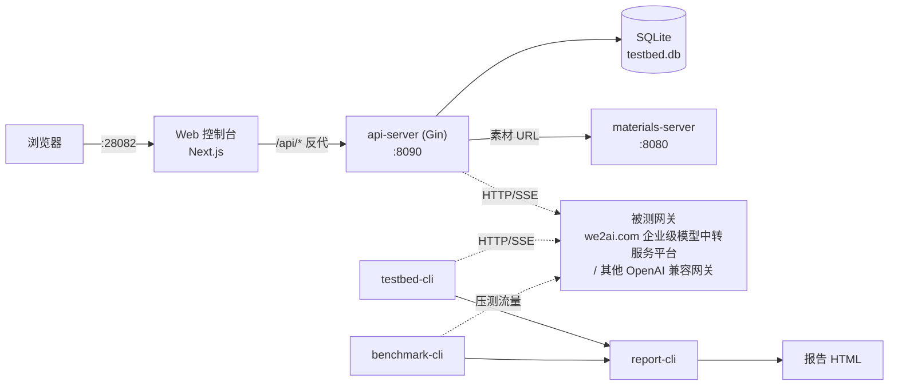
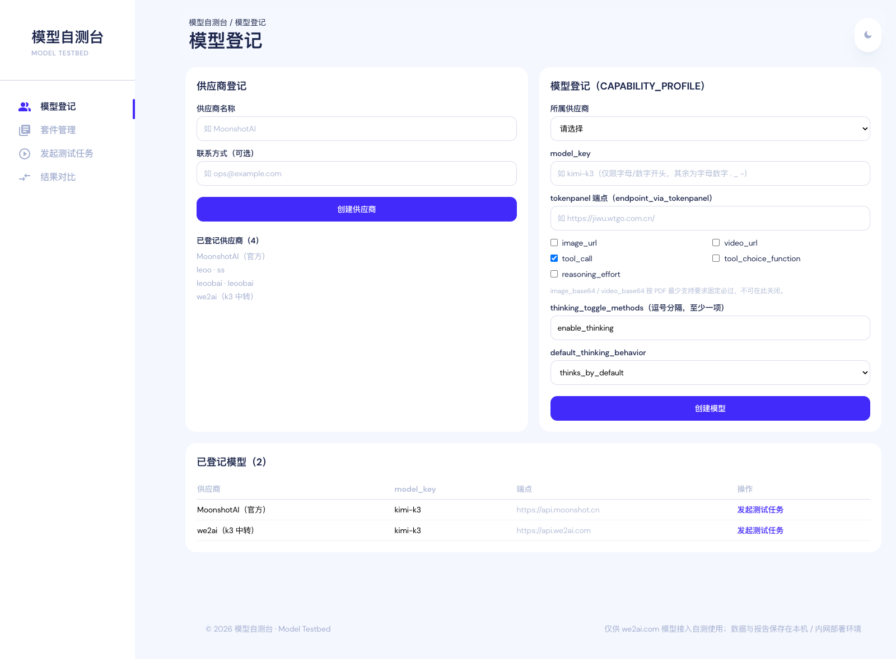
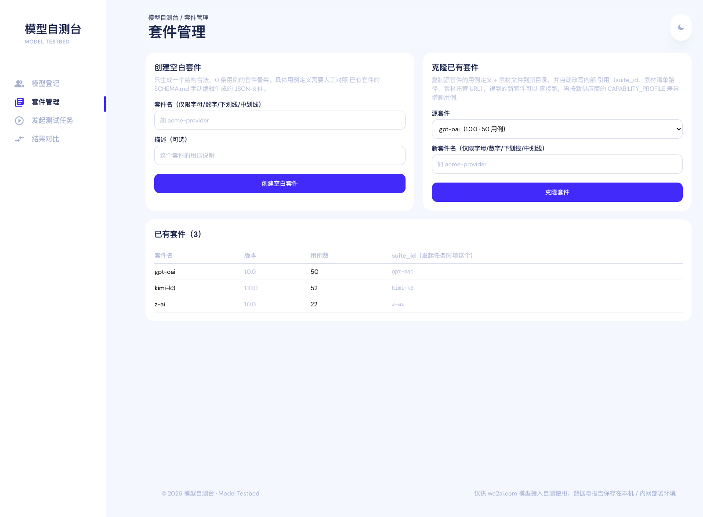
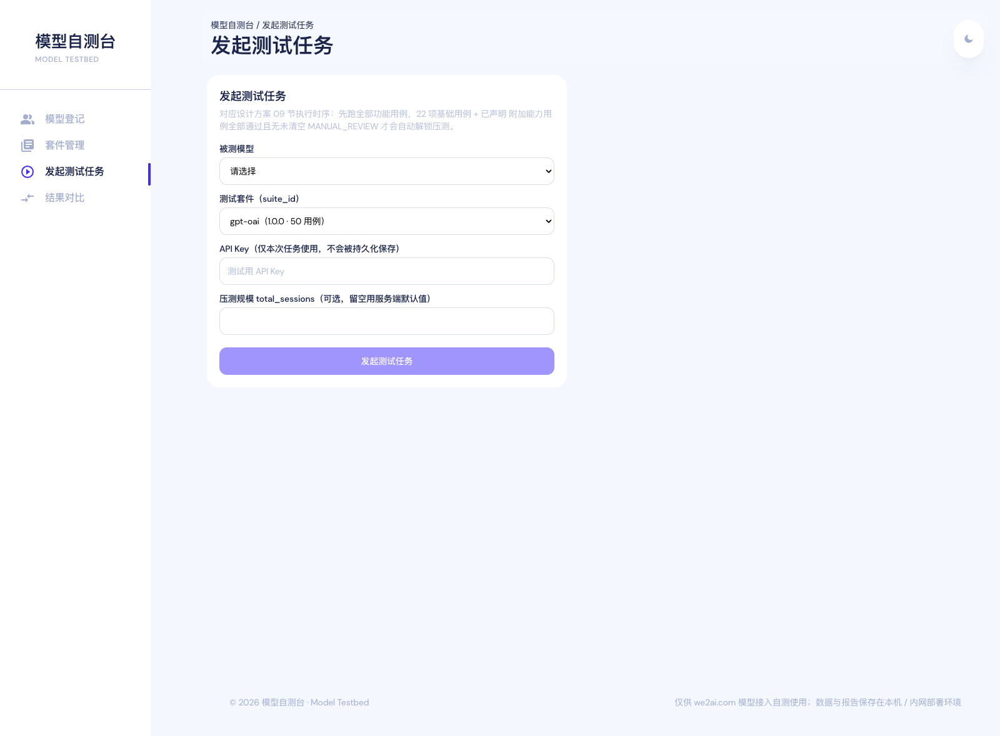
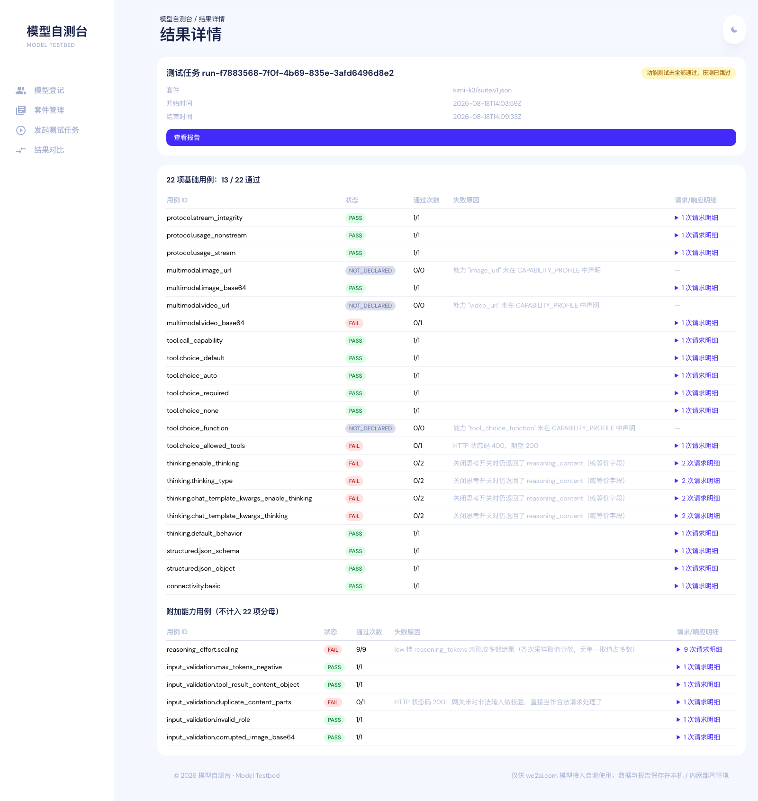
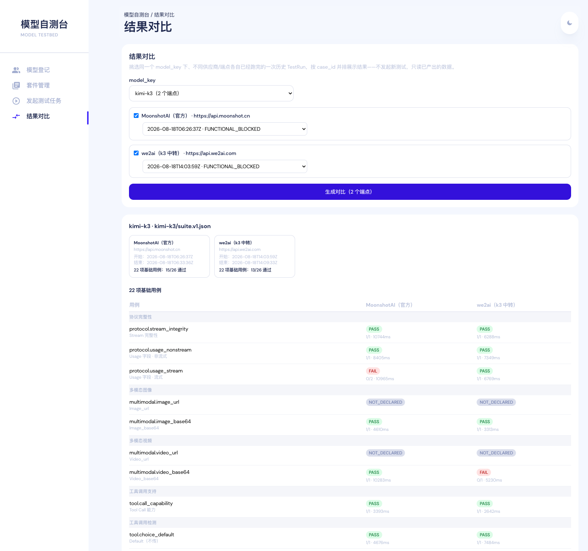
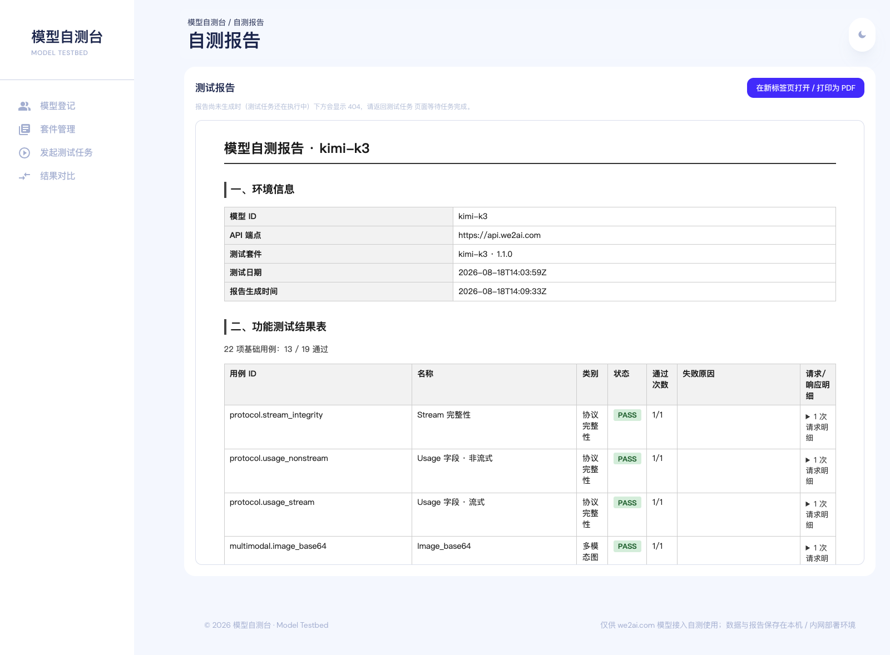

# 模型自测台（Model Testbed）

面向多供应商 LLM 接入场景的自测执行与报告平台：对被测网关（当前为 we2ai.com 企业级模型中转服务平台）暴露的 OpenAI 兼容接口（`/v1/chat/completions`，流式 + 非流式）执行功能用例断言与压测，产出可归档的自测报告，新供应商接入时按能力声明克隆/裁剪套件即可复用，不用改代码。

首版实现是单进程 + SQLite（无队列/无 Redis），目标是单人可用、能跑通全部功能与性能验收要求；更大规模的队列化架构是后续按需演进项，见 [`docs/模型自测台设计方案.md`](docs/模型自测台设计方案.md) 第 02、10 节。

## 架构（首版实现）



三个 HTTP 服务（Web / api-server / materials-server）可以合并进一个 Docker 容器只暴露 28082；三个 CLI 工具（`testbed-cli` / `benchmark-cli` / `report-cli`）也可以脱离 Web 控制台单独串联使用，直接跑功能测试、压测、出报告。

## 目录结构

| 路径 | 内容 |
|---|---|
| `cmd/api-server` | 调度 API（Gin + SQLite），供 Web 控制台消费 |
| `cmd/materials-server` | 多模态确定性素材的静态文件服务 |
| `cmd/testbed-cli` | 功能用例引擎命令行入口，独立于 Web 控制台可单独跑 |
| `cmd/benchmark-cli` | 压测引擎命令行入口 |
| `cmd/report-cli` | 汇总功能测试 + 压测结果，生成报告 HTML |
| `internal/` | 上述命令行工具与 API 共用的核心逻辑（engine/assertion/benchmark/store/report ...） |
| `web/` | Web 控制台前端（Next.js + Tailwind） |
| `suites/` | 测试套件定义（`suite.v1.json`）与多模态素材 |
| `reports/` | 测试结果与报告产物 |
| `docs/模型自测台设计方案.md` | 完整设计方案（架构、数据模型、验收规则、SOP） |

## 快速开始

### Docker（推荐，三个服务打包成一个容器）

```bash
docker compose up -d --build
# 浏览器访问 http://localhost:28082
```

数据（SQLite + 套件素材 + 报告）持久化在 `modeltestbed_data` volume。默认 `AUTH_TOKEN=""` 不鉴权，仅限本地/内网——**当前前端不携带 `Authorization` 头，把 `AUTH_TOKEN` 设成非空值会让控制台所有请求 401**，详见 [通过 Web 控制台使用](#通过-web-控制台使用) 一节的说明。

### 本地开发

```bash
# 素材服务
go run ./cmd/materials-server -addr :8080 -root suites

# 调度 API
go run ./cmd/api-server -addr :8090 -materials-base-url http://127.0.0.1:8080

# Web 控制台
cd web && npm install && npm run dev   # http://localhost:3000，需要 web/.env.local 指向 :8090
```

## 通过 Web 控制台使用

侧边栏有 4 个入口：模型登记、套件管理、发起测试任务、结果对比；结果详情与报告页从任务里进入。完整走一遍的顺序如下。

### 1. 启动并打开控制台

```bash
docker compose up -d --build
```

浏览器访问 <http://localhost:28082>。容器内三个进程（Next.js `:28082` / api-server `:8090` / materials-server `:8080`）走 loopback 通信，Next.js 用 `rewrites` 把 `/api/*` 反代给 api-server，所以对外只需要暴露 28082 一个端口。

数据全部落在 `modeltestbed_data` volume 的 `/data` 下，`docker compose down` 不会丢：

| 路径 | 内容 |
|---|---|
| `/data/testbed.db` | SQLite：供应商、模型与能力声明、套件、运行记录 |
| `/data/materials` | 套件素材（图片/视频）；UI 创建/克隆出来的套件素材只存在这里 |
| `/data/reports` | 用例结果 JSON、压测原始日志、报告 HTML |

> **`AUTH_TOKEN` 注意事项**：api-server 支持 `-auth-token` 固定 Token 鉴权（校验 `Authorization: Bearer <token>`），但当前前端发起 fetch 时不带任何鉴权头（`web/src/utils/apiClient.ts` 顶部注释里已把这个限制写明）。因此**只要把 `AUTH_TOKEN` 设成非空值，控制台所有请求都会 401**。需要对外暴露时，保持 `AUTH_TOKEN=""`，把 28082 挡在内网或反向代理的鉴权之后，不要直接挂公网。

### 2. 模型登记（`/admin/providers`）

先建供应商，再建模型。`model_key` 填上游真实模型名（如 `kimi-k3`），端点填网关地址，下半部分勾出这个模型实际具备的能力——能力声明是套件裁剪的唯一依据：没声明的可选能力（`image_url`/`video_url`/`tool_choice_function`/`reasoning_effort`/思考开关的具体方式）对应用例会标成 `NOT_DECLARED` 自动跳过，不计入基础用例分母；`image_base64`/`video_base64` 按「最少支持」要求固定必过，表单里关不掉。`thinking_toggle_methods` 至少填一项，`default_thinking_behavior` 要与网关实际行为一致（它是一条独立必过用例的判定依据）。

同一个 `model_key` 可以挂在多个供应商/端点下，登记后模型列表里每条都带「发起新测试任务」入口。



### 3. 套件管理（`/admin/suites`）

镜像自带 `kimi-k3`、`z-ai`、`gpt-oai` 三个种子套件，直接就能用来跑，不必新建。接第二个供应商时用「克隆已有套件」：套件定义、素材文件与内部引用会被一起复制改写，之后按 `SCHEMA.md` 手工编辑 JSON 增删差异用例。「创建空白套件」只生成骨架，用例仍需人工按 schema 补齐。

套件定义存 SQLite（Docker 部署下随 `/data/testbed.db` 持久化，容器重建不丢），`suites/` 目录降级为烧录进镜像的只读种子。



### 4. 发起测试任务（`/admin/test-runs/new`）

选被测模型 + 测试套件，填入该模型的测试用 API Key（**只在本次任务内存里使用，不落库**），`total_sessions` 不填就用服务端默认压测规模。提交后跳到结果详情页并自动轮询状态。

一次任务按设计方案 09 节的时序串起来跑：先跑全部功能用例 → 基础用例全过、且没有未清空的 `MANUAL_REVIEW` 才自动接着跑压测 → 最后生成报告。功能用例没过就是 `FUNCTIONAL_BLOCKED`，压测直接跳过。



### 5. 看结果详情（`/admin/test-runs/<runId>`）

页面上半部分是「基础用例」表（`counts_in_base22=true`，Kimi-K3 当前是 26 项），下半部分是「附加能力用例」（不计入基础分母）。每行给出状态徽标、通过次数、耗时和失败原因，展开可以看逐次请求/响应留痕。



### 6. 结果对比（`/admin/compare`）

先选 `model_key`，再勾选 ≥2 个端点、各自挑一次已经跑完的历史运行，按 `case_id` 并排展示。用于「同一个模型换了供应商/通道之后结果有没有变」以及「修复后重测」的快速定位，只读已有数据、不发起新测试。注意这一页只对比功能用例结果，不含压测指标。



### 7. 查看/导出报告（`/admin/reports/<runId>`）

报告按设计方案 08 节的结构渲染成自包含单页 HTML：环境信息、功能测试结果表、性能测试结果、能力声明与豁免说明、验收结论。右上角「在新标签页打开 / 打印为 PDF」调用浏览器打印，选「存储为 PDF」即可导出，不需要额外的 PDF 生成服务。



## 命令行工具

| 工具 | 用途 | 示例 |
|---|---|---|
| `testbed-cli` | 对某个模型跑一遍套件里的功能用例，按能力声明自动跳过不适用项 | `go run ./cmd/testbed-cli -suite suites/kimi-k3/suite.v1.json -base-url https://<gateway> -api-key <key> -model-key <model> -capability suites/kimi-k3/capability_kimi-k3.real.json -out result.json` |
| `benchmark-cli` | 对某个模型执行爬坡压测，解析吞吐/延迟指标 | `go run ./cmd/benchmark-cli -suite suites/kimi-k3/suite.v1.json -base-url https://<gateway> -api-key <key> -model-key <model> -out benchmark.json` |
| `report-cli` | 汇总 `testbed-cli` + `benchmark-cli` 产物，生成验收报告 | `go run ./cmd/report-cli -case-results result.json -capability suites/kimi-k3/capability_kimi-k3.real.json -benchmark benchmark.json -model-id <id> -endpoint <url> -test-date 2026-08-18 -out report.html` |

每个工具都支持 `-h` 查看完整参数。

## 技术栈

| 层 | 选型 |
|---|---|
| 后端 | Go 1.26, Gin, `modernc.org/sqlite`（纯 Go，无需 CGO） |
| 前端 | Next.js 15, React 19, TypeScript, Tailwind CSS |
| 存储 | SQLite（首版单进程场景） |
| 部署 | 单 Dockerfile 多阶段构建，`docker-compose.yml` 一键起容器 |

## 文档

- [设计方案](docs/模型自测台设计方案.md) — 架构、数据模型、用例引擎规则、验收标准、部署路线
- [套件 Schema](suites/kimi-k3/SCHEMA.md) — 测试套件定义文件格式
- [z-ai 套件说明](suites/z-ai/SCHEMA.md) — z.ai（GLM）套件的用例映射、新增断言类型与首次运行校准项

## 版权与维护

Copyright © 2026 we2ai.com. All rights reserved.

本项目由 we2ai.com 负责开发与维护。代码、测试套件、文档及报告模板的版权归 we2ai.com 所有，未经书面授权不得复制、分发或用于商业用途。
