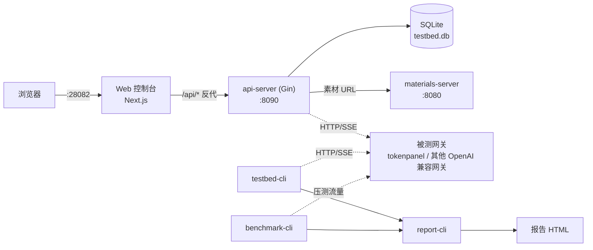

# 模型自测台（Model Testbed）

面向多供应商 LLM 接入场景的自测执行与报告平台：对被测网关暴露的 OpenAI 兼容接口（`/v1/chat/completions`，流式 + 非流式）执行功能用例断言与压测，产出可归档的自测报告，新供应商接入时按能力声明克隆/裁剪套件即可复用，不用改代码。

首版实现是单进程 + SQLite（无队列/无 Redis），目标是单人可用、能跑通全部功能与性能验收要求；更大规模的队列化架构是后续按需演进项，见 [`docs/模型自测台设计方案.md`](docs/模型自测台设计方案.md) 第 02、10 节。

## 架构（首版实现）



三个 HTTP 服务（Web / api-server / materials-server）可以合并进一个 Docker 容器只暴露 28082；三个 CLI 工具（`testbed-cli` / `benchmark-cli` / `report-cli`）也可以脱离 Web 控制台单独串联使用，直接跑功能测试、压测、出报告。

## 目录结构

| 路径 | 内容 |
|---|---|
| `cmd/api-server` | 调度 API（Gin + SQLite），供 Web 控制台消费 |
| `cmd/materials-server` | 多模态确定性素材的静态文件服务 |
| `cmd/testbed-cli` | 功能用例引擎命令行入口，独立于 Web 控制台可单独跑 |
| `cmd/benchmark-cli` | 压测引擎命令行入口 |
| `cmd/report-cli` | 汇总功能测试 + 压测结果，生成报告 HTML |
| `internal/` | 上述命令行工具与 API 共用的核心逻辑（engine/assertion/benchmark/store/report ...） |
| `web/` | Web 控制台前端（Next.js + Tailwind） |
| `suites/` | 测试套件定义（`suite.v1.json`）与多模态素材 |
| `reports/` | 测试结果与报告产物 |
| `docs/模型自测台设计方案.md` | 完整设计方案（架构、数据模型、验收规则、SOP） |

## 快速开始

### Docker（推荐，三个服务打包成一个容器）

```bash
docker compose up -d --build
# 浏览器访问 http://localhost:28082
```

数据（SQLite + 报告）持久化在 `modeltestbed_data` volume。公网部署前请在 `docker-compose.yml` 里给 `AUTH_TOKEN` 设置一个值（默认空 = 不鉴权，仅限内网）。

### 本地开发

```bash
# 素材服务
go run ./cmd/materials-server -addr :8080 -root suites

# 调度 API
go run ./cmd/api-server -addr :8090 -materials-base-url http://127.0.0.1:8080

# Web 控制台
cd web && npm install && npm run dev   # http://localhost:3000，需要 web/.env.local 指向 :8090
```

## 命令行工具

| 工具 | 用途 | 示例 |
|---|---|---|
| `testbed-cli` | 对某个模型跑一遍套件里的功能用例，按能力声明自动跳过不适用项 | `go run ./cmd/testbed-cli -suite suites/kimi-k3/suite.v1.json -base-url https://<gateway> -api-key <key> -model-key <model> -capability suites/kimi-k3/capability_kimi-k3.real.json -out result.json` |
| `benchmark-cli` | 对某个模型执行爬坡压测，解析吞吐/延迟指标 | `go run ./cmd/benchmark-cli -suite suites/kimi-k3/suite.v1.json -base-url https://<gateway> -api-key <key> -model-key <model> -out benchmark.json` |
| `report-cli` | 汇总 `testbed-cli` + `benchmark-cli` 产物，生成验收报告 | `go run ./cmd/report-cli -case-results result.json -capability suites/kimi-k3/capability_kimi-k3.real.json -benchmark benchmark.json -model-id <id> -endpoint <url> -test-date 2026-08-18 -out report.html` |

每个工具都支持 `-h` 查看完整参数。

## 技术栈

| 层 | 选型 |
|---|---|
| 后端 | Go 1.26, Gin, `modernc.org/sqlite`（纯 Go，无需 CGO） |
| 前端 | Next.js 15, React 19, TypeScript, Tailwind CSS |
| 存储 | SQLite（首版单进程场景） |
| 部署 | 单 Dockerfile 多阶段构建，`docker-compose.yml` 一键起容器 |

## 文档

- [设计方案](docs/模型自测台设计方案.md) — 架构、数据模型、用例引擎规则、验收标准、部署路线
- [套件 Schema](suites/kimi-k3/SCHEMA.md) — 测试套件定义文件格式
- [z-ai 套件说明](suites/z-ai/SCHEMA.md) — z.ai（GLM）套件的用例映射、新增断言类型与首次运行校准项
