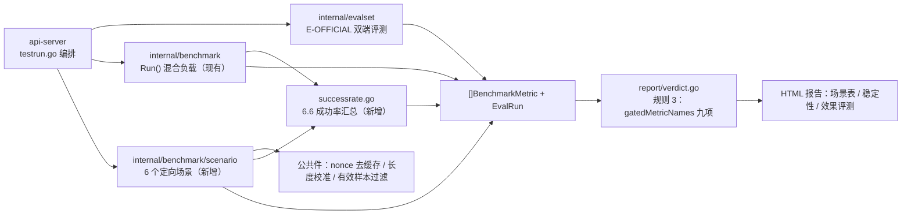

# v0.6 验收指标实现计划

> 对应 `docs/模型自测台设计方案.md` v0.6 的 6.4–6.7 节与 14 节 P6 阶段。被测对象：[we2ai.com](https://we2ai.com) 企业级模型中转服务平台（OpenAI 兼容端点）；参照端点：供应商官方 API。目标：让 6.4 表九项门禁全部由代码产出指标行并进入规则 3 判定；本文只讲怎么落地，口径定义不重复。

## 1. 现状与差距

| 需求项 | 现有能力（代码位置） | 差距 | 改动量 |
|---|---|---|---|
| TTFT 16K/100K 无缓存 avg | 混合负载下已算 TTFT 全分位（`internal/benchmark/runner.go` `computeMetrics`），判定看 P50 vs 15s | 无受控输入长度、无 nonce 去缓存、无 avg 硬阈值、无长度校准 | 新增场景框架 + 2 个场景 |
| TPOT avg < 20ms | 已按标准定义算 TPOT（`outcome.go`），但混合负载短输出样本会产生 0.009ms 假流式值 | 无长输出受控场景、无假流式样本剔除规则 | 新增 1 个场景 + 有效样本过滤 |
| 缓存 95% / 1min / 10min | `usage.cached_tokens` 两种位置已能读（`openaiapi/types.go` `Usage.CachedTokens`）；`prompt_cache_hit_rate` 断言已有预热+探测雏形（`internal/assertion`） | 无共享前缀 + 唯一后缀构造、无静默等待、无期望比例校准 | 新增 3 个场景（共用一个执行器） |
| 请求成功率 ≥ 99% | `RequestOutcome.Success` 已记录每次请求成败 | 无跨混合负载+场景的汇总、无失败分类、无最小分母 | 新增汇总函数 |
| 官方评测集 Δ < 3pp | 无 | 评测集格式、打分器、双端执行、`EVAL_RUN` 存储、参照端点配置全部缺失 | 新包 `internal/evalset` |
| 规则 3 门禁 | `internal/report/verdict.go` `gatedMetricNames` 写死 4 项，白名单判定逻辑可复用 | 清单换成 6.4 表九项；`PENDING` 已有状态可直接复用 | 改常量 + 报告模板 |
| 数据模型 | `model.BenchmarkMetric` 无 scenario/sample_count/invalid_samples/threshold；无 `EvalRun` | 加字段、加结构体、SQLite 列迁移 | 小 |

## 2. 目标架构

执行顺序（09 节时序）：功能用例 → 效果评测 → 混合负载压测 → 六个场景串行 → 成功率汇总 → 报告。`benchmark.Run` 现有互斥锁 `runMu` 扩展为覆盖场景执行，保证同一进程内压测阶段不重叠。

## 3. 分步实施（每步独立可合并，按序执行）

### Step 1 · 数据模型与门禁清单（0.5 天）

| 动作 | 文件 | 验收 |
|---|---|---|
| `BenchmarkMetric` 加 `Scenario string`、`SampleCount int`、`InvalidSamples int`、`Threshold float64`（json tag 与 03 节一致） | `internal/model/model.go` | 现有 `runner_test.go` 全绿，JSON 序列化含新字段 |
| 新增 `EvalRun` 结构体（字段同 03 节 `EVAL_RUN`）；`TestRun` 加 `EvalResultPath` | `internal/model/model.go` | — |
| `TestRunStatus` 加 `RUNNING_EVAL`；`ValidateTestRunStatus` 同步 | `internal/model/model.go` | 状态枚举测试覆盖新值 |
| SQLite：`test_runs` 加 `eval_result_path` 列；`eval_runs` 新表；启动时 `ALTER TABLE ... ADD COLUMN` 幂等迁移 | `internal/store/` | 旧库文件启动不报错，新库能写读 `EvalRun` |
| `gatedMetricNames` 改为 6.4 表九项；`evalRule3` 新增 `PENDING` 来源：`Note` 以 `PENDING:` 前缀时判待确认（或加 `BaselinePending` 枚举，二选一，推荐加枚举） | `internal/report/verdict.go`、`model.go` | `verdict_test.go` 新增用例：九项齐全 OK / 缺任一 PENDING / 任一 FAIL 总体 FAIL |
| 报告模板规则 3 文案与指标名同步 | `internal/report/template.go` | 渲染快照测试更新 |

### Step 2 · 场景框架与公共件（1 天）

新建 `internal/benchmark/scenario/`：

| 文件 | 内容 | 验收（httptest 假网关） |
|---|---|---|
| `scenario.go` | `type Scenario interface { ID() string; Run(ctx, Env) ([]model.BenchmarkMetric, []RequestOutcome, error) }`；`Env{BaseURL, APIKey, ModelKey, HTTPClient, Timeout, Log io.Writer, Capability}`；`RunAll(ctx, env, []Scenario)` 串行执行、单场景失败不中断其余、返回全部 outcome 供 6.6 使用 | 两个假场景，一个 panic/报错，另一个照常产出 |
| `nonce.go` | `NoCachePrefix() string`：`[nonce:<uuid>]` + 64 token 量级随机文本 | 连续调用两两不同 |
| `filler.go` | `BuildInput(targetTokens int, ratio float64) string` 按「字符/token」比生成；`Calibrate(ctx, env, probeChars) (ratio float64, err)` 发 1 次请求用 `usage.prompt_tokens` 校准 | 假网关按固定比例回 prompt_tokens，校准后生成长度落在 ±10% |
| `filter.go` | 有效样本规则：`WithinTokenRange(lo, hi)`、`NoCache(maxRatio=0.01)`、`RealStreaming(minTokens=256, minChunks=32, minSpan=0.5s)`；返回剔除原因枚举，累计到 `InvalidSamples` 与 note | 每条规则正反例 |
| `judge.go` | `HardThreshold(avg, threshold float64, lowerIsBetter bool, minSamples int) (BaselineVerdict, note)`：不套 `MaxDegradeRatio`；样本不足 → PENDING | 边界值：等于阈值判 FAIL（原文是「小于」） |

`StreamCallResult` 需补 `ContentChunkCount int` 与 `FirstContentAt/DoneAt`（若 `executor.go` 尚未暴露）供 `RealStreaming` 使用。

### Step 3 · S-T16 / S-T100 / S-TPOT（1 天）

| 场景 | 实现要点 | 验收（假网关） |
|---|---|---|
| `ttft_nocache.go`（参数化 16K/100K） | 校准 → N 次串行请求（nonce + filler + 短问题，`max_tokens=64`，thinking disabled，stream）→ 过滤 → `HardThreshold(avg, 4.0/7.0, lower, 10/5)`；100K 前检查 `Capability.ContextWindowTokens < 110_000` → 直接产出 `NOT_OBSERVABLE` 行 | ① 假网关延迟 3s 首包 → OK；② 5s → FAIL；③ 回 cached_tokens=50% → 全部剔除 → PENDING；④ 上下文 32K 模型 → S-T100 NOT_OBSERVABLE |
| `tpot_long_output.go` | nonce + 1K 输入 + 长文提示，`max_tokens=1024`；过滤 `RealStreaming`；`HardThreshold(avg, 20, lower, 10)` | ① 假网关按 10ms/分片流式 300 token → OK；② 整段一次性返回 → 全部剔除 → PENDING；③ 30ms/分片 → FAIL |

指标行统一：`Name` 取 6.4 表名，`Scope="scenario"`，`Scenario=场景 ID`，`Avg/P50/P95` 填充，`Threshold` 填阈值原值。

### Step 4 · S-C95 / S-C1M / S-C10M（1 天）

一个执行器 `cache_scenarios.go`，三种配置：

| 配置项 | S-C95 | S-C1M | S-C10M |
|---|---|---|---|
| prefixTokens | 16K | 16K | 16K |
| suffixMaxRatio | 0.05 | 0（探测用同一后缀） | 0 |
| groups (K) | 1 | 3 | 3 |
| probesPerGroup (N) | 10 | 1 | 1 |
| silence | 2s 间隔 | 60s | 600s |
| parallelGroups | — | true | true |
| threshold | 0.94 | 0.94 | 0.80 |

流程：`calibrateSuffix`（仅 S-C95）→ 校验 `P/(P+s) ≥ 0.95` → 预热 → 静默（`time.Sleep` 可被 ctx 取消；测试注入 `sleepFn`）→ 探测 → `hit = cached/prompt` → `HardThreshold(avg, threshold, higher, min)`。`cached_tokens` 全部未观测 → `NOT_OBSERVABLE`。

验收（假网关记录前缀，按「是否见过同前缀」返回 cached_tokens）：① 正常命中 96% → OK；② 网关 TTL 模拟 5 分钟 → S-C1M OK、S-C10M FAIL；③ 不回 cached_tokens → 三项 NOT_OBSERVABLE；④ 后缀占比 8% → S-C95 PENDING 且 note 含校准值。

### Step 5 · 请求成功率（0.5 天）

| 动作 | 文件 | 验收 |
|---|---|---|
| `successrate.go`：输入混合负载 + 场景全部 `RequestOutcome`，输出 `request_success_rate` 指标行；分母 < 300 → PENDING；失败分类（timeout/5xx/4xx/stream_broken/parse_error）按场景计数写 note | `internal/benchmark/` | 300 次中 3 次失败 → OK（0.99 恰好达标，原文是 ≥）；4 次 → FAIL；200 次 → PENDING |
| `RequestOutcome` 加 `Scenario string`、`FailureClass string`；`DeriveOutcome` 填充分类 | `outcome.go` | 每类失败一条测试 |
| `runner.go` 的 `Run` 末尾串接：`RunAll(scenarios)` → `successRate(all)` → 合并指标 | `runner.go` | `runner_test.go` 端到端：指标切片含九项名字 |

### Step 6 · 效果评测 `internal/evalset`（2 天）

| 文件 | 内容 | 验收 |
|---|---|---|
| `dataset.go` | 读 `datasets/<id>/<version>.jsonl`，校验字段、算 sha256；行结构 `{id, messages, expected, scorer, scorer_params}` | 缺字段/坏 JSON 报行号 |
| `scorer.go` | `exact_match`（NFKC + 去空白 + 小写）、`choice`（正则提取首个 A–H）、`numeric`（`abs_tol`/`rel_tol`）、`contains` | 每种打分器正反例 |
| `runner.go` | `Run(ctx, Endpoint{gateway}, Endpoint{reference}, dataset, Params) (model.EvalRun, []ItemResult)`：并发 ≤ 4，两端参数同一结构体，逐题落 JSONL；`delta_pp`、两比例差 95% CI（Wald 近似）；n < 500 或参照失败 → PENDING | 假网关：两端各 600 题，故意让参照多对 20 题 → Δ=3.33 FAIL；多对 15 题 → Δ=2.5 OK；参照端 401 → PENDING |
| `metric.go` | 产出 `eval_score_delta_pp` 指标行（`Scope="overall"`，`Avg=delta_pp`，`Threshold=3`） | — |
| 配置 | `Model` 加 `ReferenceEndpoint string`、`ReferenceAPIKeyEnv string`（密钥只从环境变量读，不入库）；`Provider`/前端模型登记页加两个输入框 | 登记页能保存并回显；密钥不出现在任何 JSON 产物 |
| 编排 | `testrun.go`：功能通过后进入 `RUNNING_EVAL`，写 `EvalRun` + `EvalResultPath`，指标并入 `benchmarkMetrics` 后再进压测 | 端到端用假网关跑一次，`GET /api/test-runs/:id` 含 `eval_run` |
| 报告 | 模板新增「效果评测」小节：题集/版本/sha256、n、三列分数、Δ、CI、不一致题目前 50 条 | 渲染快照 |
| CLI | `cmd/eval-cli`：`-dataset -gateway-base-url -reference-base-url -model-key -out`，便于在没有 UI 时独立跑参照 | `-h` 输出与 README 段落一致 |

评测集文件由用户提供（见 15.2 节待决策）；仓库先放 `datasets/README.md` 说明格式与一个 5 题的 `sample/` 供测试。

## 4. 接口与产物变更清单

| 类型 | 变更 |
|---|---|
| `GET /api/test-runs/:id` | 新增 `eval_run` 对象；`benchmark_metrics[]` 元素新增 4 字段 |
| `POST /api/test-runs` | 新增可选 `scenarios: ["S-T16", ...]`（默认全部）、`eval: true|false`（默认有参照端点则 true） |
| `benchmark-cli` | 新增 `-scenarios`（逗号分隔，默认 all）、`-skip-mixed-load`（只跑场景，调试用） |
| 落盘 | `<run>-benchmark.json` 增加场景指标；`<run>-eval.jsonl` 逐题结果；`<run>-eval.json` `EvalRun` |
| 报告 HTML | 性能章节加「定向场景」「稳定性」两张表；新增「效果评测」章节；规则 3 文案更新 |

## 5. 测试策略

| 层 | 手段 | 覆盖 |
|---|---|---|
| 单元 | 表驱动测试，`httptest.Server` 假网关（复用 `runner_test.go` 模式），`sleepFn` 注入避免真实等待 | 每个过滤规则、每个判定边界（等于阈值）、每个 NOT_OBSERVABLE/PENDING 分支 |
| 集成 | `engine_acceptance_test.go` 同款：假网关一次性提供功能 + 评测 + 压测 + 场景全链路，断言 `verdict.Compute` 结果 | 九项齐全 OK；任一 FAIL → 总体 FAIL；任一 PENDING → 待确认 |
| 真实端点 | 用 `benchmark-cli -scenarios S-T16,S-TPOT,S-C95 -skip-mixed-load` 先跑低成本三项，再跑全量；结果归档到 `reports/<suite>/P6-*.md` | 与 kimi-k3 08-18 报告对照：缓存命中率历史 93.9–98.4%，S-C95 预期 OK；TPOT 假流式样本被剔除后 avg 落在 4–12ms 区间 |

## 6. 排期与耗时

| 步骤 | 工作量 | 依赖 | 单次真实运行耗时 / 成本增量 |
|---|---|---|---|
| Step 1 模型与门禁 | 0.5 天 | — | — |
| Step 2 场景框架 | 1 天 | Step 1 | — |
| Step 3 TTFT/TPOT | 1 天 | Step 2 | ≈ 3 分钟 / ≈ 1.4M 无缓存输入 token（S-T100 占 1.0M） |
| Step 4 缓存三场景 | 1 天 | Step 2 | ≈ 11.5 分钟（S-C10M 主导）/ ≈ 0.4M token，其中约 80% 命中缓存 |
| Step 5 成功率 | 0.5 天 | Step 3、4 | — |
| Step 6 效果评测 | 2 天 | Step 1、评测集到位 | 取决于题数：1000 题 × 2 端 × ≈ 300 token ≈ 0.6M token，≈ 10 分钟 |
| 合计 | 6 天 | | 压测阶段总时长从约 13 分钟增至约 35 分钟 |

Step 3/4 可并行开发；Step 6 可与 Step 2–5 并行，只在编排处汇合。

## 7. 风险与边界

| 风险 | 影响 | 对策 |
|---|---|---|
| 评测集拿不到题集，只有公布分数 | 效果门禁无法执行 | 指标记 PENDING，报告标注；不用公布分做判定（6.7 已定） |
| 3 个百分点与 n=500 的抽样噪声同量级 | 边缘结果不稳定 | 报告给 CI；建议 n ≥ 1000；判定仍看点估计（用户原文） |
| 网关对 100K 请求限流/超时 | S-T100 大量失败，同时拉低 6.6 成功率 | 场景超时单独配置（默认 180s）；失败计入成功率分母属正确行为，报告按场景分组展示失败来源 |
| 缓存 TTL 由上游供应商决定，网关无法改变 | S-C10M FAIL 时责任不在网关 | 报告同时展示参照端点（官方 API）同场景结果需另跑一次；首版只标注「缓存策略取决于上游」，不自动免责 |
| S-C10M 期间进程被重启 | 10 分钟等待丢失 | 场景级重试上限 1 次；ctx 取消即产出 PENDING 行，不阻塞报告 |
| `time.Sleep` 在单元测试里拖慢 CI | — | 注入 `sleepFn`，测试用零延迟 |
