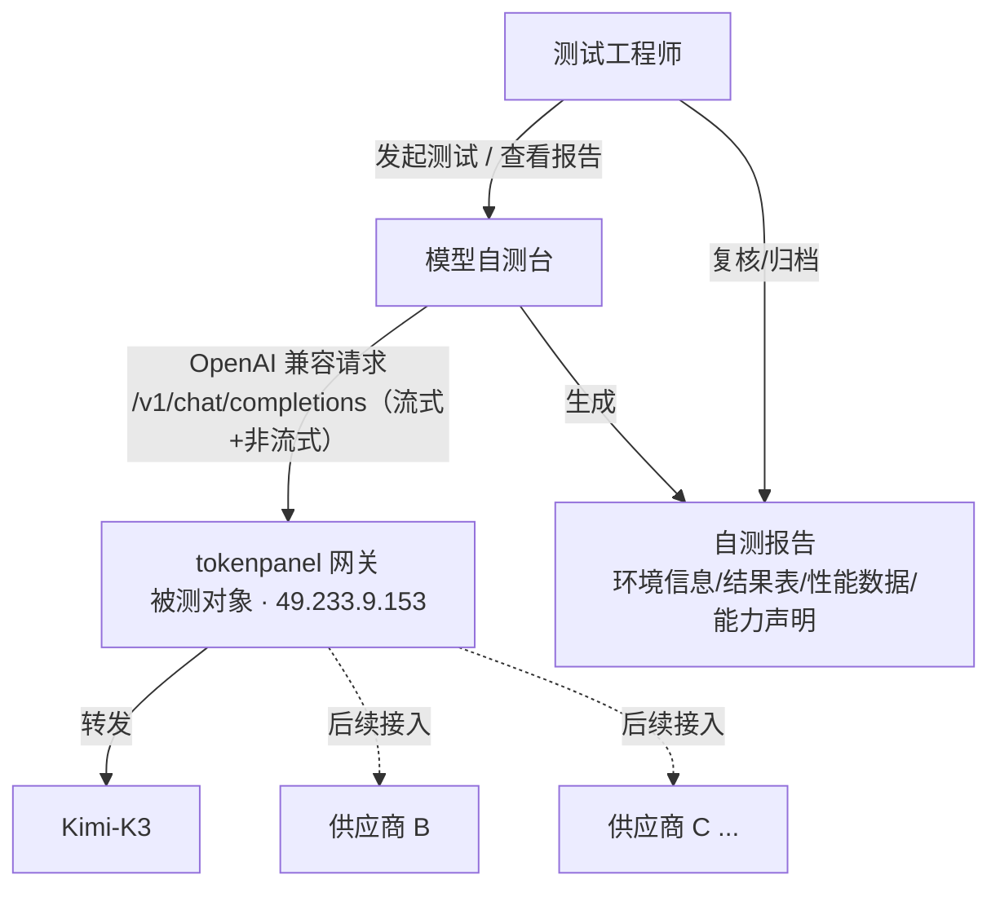
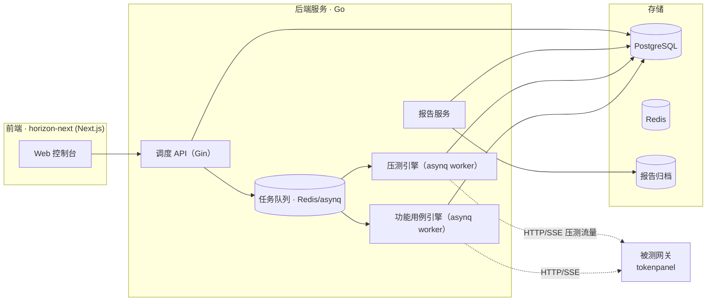
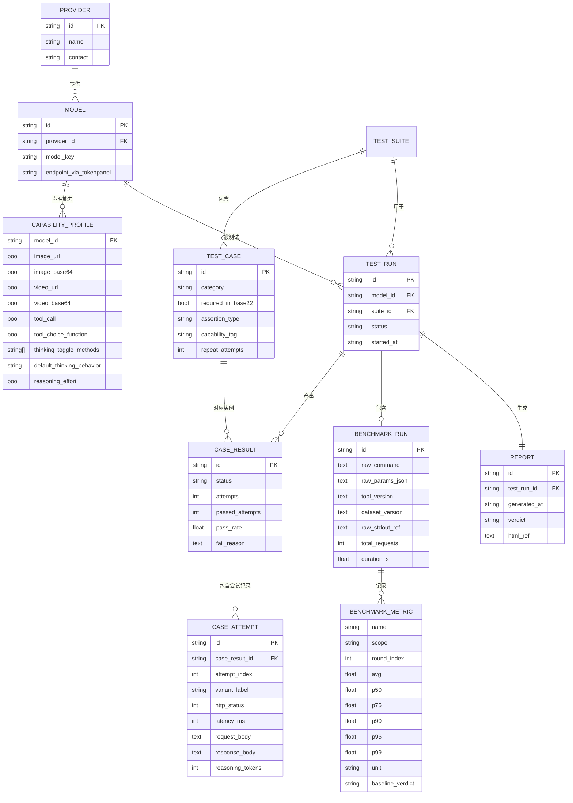
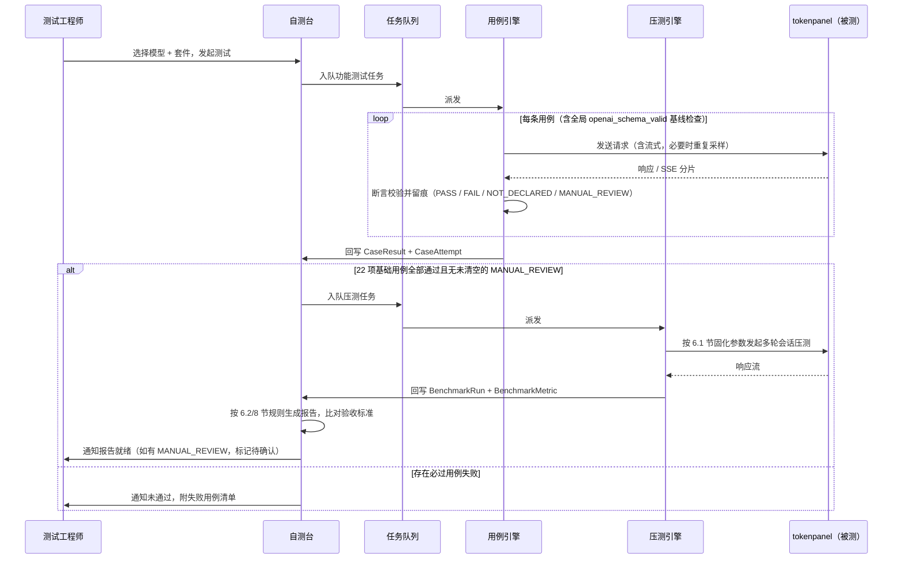

# 模型自测台 · 设计方案

> v0.3 · 未包含任何实现代码，供确认后进入开发阶段
> 修订历史：
> - v0.2：Codex 逐条审核 PDF 后，发现多处断言逻辑与 PDF 检查点不符、性能数据模型缺字段、验收规则不可机器执行、首版技术栈范围过大，按审核意见逐条修订，实施路径改为「先跑通全部 PDF 要求，再按需扩展」的最小路径。
> - v0.3：Fable 5 对 v0.2 做终审，发现三处规格层面问题——性能判定规则方向判反（导致优于基线的结果被误判 FAIL）、验收规则遗漏能力声明门禁、`CASE_RESULT` 无法承载多请求用例留痕——以及若干中低优先级口径缺口，本版逐条修复，详见第 15 节。
> 面向多供应商 LLM 接入场景的自测执行与报告平台：以《Kimi-K3 供应商接入自测指导》为首个测试套件模板，对被测网关（tokenpanel）暴露的 OpenAI 兼容接口执行功能与性能自测，产出符合验收要求的自测报告，并支持后续供应商按能力声明复用/扩展套件。

- **被测对象**：tokenpanel（OpenAI 兼容网关，49.233.9.153）
- **首期部署**：本地 / 独立环境
- **技术栈**：Go 后端 + `docs/sample/horizon-next-1.0.0`（Horizon UI，Next.js 15 + React 19 + Tailwind 后台模板）

---

## 目录

1. [系统定位与范围](#01-系统定位与范围)
2. [总体架构](#02-总体架构)
3. [数据模型](#03-数据模型)
4. [功能用例引擎](#04-功能用例引擎)
5. [Kimi-K3 用例目录](#05-kimi-k3-用例目录首个套件模板)
6. [压测引擎](#06-压测引擎)
7. [新供应商接入 SOP](#07-新供应商接入-sop)
8. [报告生成](#08-报告生成)
9. [执行时序](#09-执行时序)
10. [技术栈选型](#10-技术栈选型)
11. [与 tokenpanel 对接](#11-与-tokenpanel-对接)
12. [安全与凭据管理](#12-安全与凭据管理)
13. [部署路线](#13-部署路线)
14. [实施里程碑](#14-实施里程碑)
15. [风险与待确认项](#15-风险与待确认项)

---

## 01 系统定位与范围

测试系统与 tokenpanel 是「测试台 → 被测系统 → 上游供应商」三层关系，不修改、不侵入 tokenpanel。

**范围边界**：本系统只做“黑盒调用 + 断言 + 压测 + 报告”，不接管 tokenpanel 的渠道配置、计费、鉴权体系；tokenpanel 侧的供应商接入（API Key、路由）仍由 tokenpanel 自身完成，测试台仅消费其已开通的模型端点。

---

## 02 总体架构

五个模块：控制台、调度 API、用例引擎、压测引擎、报告服务，围绕任务队列解耦，均通过标准 HTTP/SSE 调用被测网关。**这是目标架构**；首版实现方式见第 10 节（单进程、无队列），达到多用户并发等触发条件后再演进到本图的形态。

| 模块 | 职责 | 关键输入 | 关键输出 |
|---|---|---|---|
| Web 控制台 | 供应商/模型登记、套件选择、任务发起、结果查看、报告导出 | 用户操作 | 任务创建请求 |
| 调度 API | 任务生命周期管理、鉴权、任务入队、状态查询 | HTTP 请求 | Task 记录、队列消息 |
| 功能用例引擎 | 按套件逐条执行 22 项基础用例 + reasoning_effort 附加用例、断言校验、按能力声明跳过不适用项 | TestSuite + Model 能力声明 | CaseResult 逐条记录 |
| 压测引擎 | 包装 MTB Benchmark（或等价工具）执行爬坡压测，解析指标 | 压测参数模板 | BenchmarkMetric 明细 |
| 报告服务 | 汇总结果、比对验收标准、生成/导出报告、版本对比 | CaseResult + BenchmarkMetric | Report（HTML/PDF/MD） |

---

## 03 数据模型

核心是「供应商能力声明」驱动「用例是否适用」，「测试运行」串联功能结果与压测结果并归档为报告。**v0.3 变更**：新增 `CASE_ATTEMPT` 承载多请求用例（思考开关开/关、reasoning_effort 三档×N次）的逐次留痕；`CAPABILITY_PROFILE.thinking_toggle_methods` 明确为「声明支持的具体方式列表」而非描述性字符串；补全 `TEST_RUN`、`REPORT` 字段；`CASE_RESULT.status` 显式枚举取值。

**关键设计**：

- `CAPABILITY_PROFILE` 是套件裁剪的依据，但不是无条件的 —— `image_base64` 与 `video_base64` 按 PDF「最少支持」要求视为**固定必过**，不允许在能力声明里标记为不支持；`image_url`、`video_url`、`tool_choice_function`、`reasoning_effort`，以及**思考开关的每一种具体方式**（`thinking_toggle_methods` 里未列出的方式）才是真正「视声明」可跳过的能力（对应 04 节的裁剪规则）。
- `CASE_RESULT` 是用例级汇总（状态/通过率），`CASE_ATTEMPT` 是请求级明细：一次 `usage_fields_stream`（尝试拿 usage 的两段式请求）、`thinking_toggle_pair`（开/关两次）、`reasoning_effort_scaling`（三档×N次重复采样）都会产出多条 `CASE_ATTEMPT`，`variant_label` 标注该次尝试对应「开/关」「low/high/max」等具体分支，`reasoning_tokens` 仅 reasoning_effort 用例填写。这解决了 v0.2 单一请求/响应体字段装不下多请求用例留痕的问题。
- `CASE_RESULT.status` 枚举取值：`PASS`（通过）/ `FAIL`（未通过，计入 22 项分母）/ `NOT_DECLARED`（能力未声明，标记 N/A，不计入 22 项分母）/ `MANUAL_REVIEW`（自动化无法下结论，独立于 PASS/FAIL 的第三态，直至人工确认后改写为 PASS 或 FAIL，见 04、06、08 节）。

---

## 04 功能用例引擎

用例定义与执行引擎分离：用例是数据（可随供应商差异增删），引擎只认识固定的一组断言类型。**v0.2 变更**：新增全局协议基线断言、修正 Default/auto 分支的误判风险、拆分流式/非流式 usage 校验、思考开关改为「开+关」成对校验、reasoning_effort 由 3 个独立用例合并为 1 个带聚合判定的用例、多模态引入人工复核态。**v0.3 变更**：`usage_fields_stream` 改为两段式尝试（不再强制要求供应商接受 `stream_options.include_usage` 参数）；思考开关未声明的具体方式按能力声明规则跳过；`tool_call_subset` 的从严解释显式标注；状态统一用 `CASE_RESULT.status` 枚举表达，不再用单独的布尔字段。

### 4.1 全局基线（叠加在每一条用例之上，不可跳过）

| 断言类型 | 校验逻辑 |
|---|---|
| openai_schema_valid | 响应字段名、层级、类型必须符合 OpenAI Chat Completions 规范（`id/object/created/model/choices[].message或delta/finish_reason` 等），流式场景对每个 chunk 结构做同样校验。任何用例若响应结构不合规，无论业务内容是否「看起来对」都直接判 FAIL —— 这是 PDF 2.1「协议一致性」的落地，此前版本遗漏了这条全局约束，可能出现结构错误但被业务断言误判通过的情况 |

### 4.2 用例级断言类型

| 断言类型 | 校验逻辑 | 适用用例 |
|---|---|---|
| stream_integrity | SSE 分片数 ≥2，以 `[DONE]` 结束，中途无断流/网关截断 | Stream 完整性 |
| usage_fields_nonstream | `usage.prompt_tokens/completion_tokens/total_tokens` 均存在、非负、三者可加和自洽 | Usage 字段 · 非流式 |
| usage_fields_stream | 两段式：① 先不带 `stream_options.include_usage` 发起流式请求，检查最终 SSE 分片（`[DONE]` 前最后一包）是否自带合法 `usage`；② 若①未拿到，追加 `stream_options.include_usage` 重试一次，同样检查末包。两次尝试中任一成功即通过，均失败才 FAIL —— 避免把「原生尾包带 usage 但拒绝该参数」的网关误判为 FAIL（v0.2 曾强制要求参数生效，比 PDF 原文「尾包或该参数」更严） | Usage 字段 · 流式 |
| content_nonempty | HTTP 200 且返回文本内容非空、与输入语义相关 | 连通性（不涉及工具调用的单轮场景） |
| text_or_tool_call | 响应满足「非空文本」或「合法 `tool_calls`（参数为可解析 JSON）」二选一，`content` 为 `null` 但存在合法 `tool_calls` 视为通过 | tool_choice 未传（Default）、`auto` |
| tool_call_required | 响应含 ≥1 条 `tool_calls`，且每条参数均为合法 JSON | 工具调用能力、tool_choice=required |
| tool_call_forbidden | 响应不含 `tool_calls`，仅文本 | tool_choice=none |
| tool_call_named | 调用的函数名与指定一致，且该次调用的参数为合法 JSON 并满足声明的 `parameters` schema | tool_choice=function（可豁免） |
| tool_call_subset | 请求提示词需保证「大概率触发调用」（复用工具调用能力用例的提示词模板）；断言调用次数 ≥1 且全部函数名 ⊆ `allowed_tools` 给定集合 —— 零次调用不再视为通过。**口径说明**：PDF 原文对 allowed_tools 只要求「在给定子集内选择」，未明确要求至少调用一次；「≥1 次」是本方案为避免空集合误通过而做的从严工程解释，如实际供应商对此有异议，可在能力声明里单独豁免 | tool_choice=allowed_tools |
| thinking_toggle_pair | 对同一开关方式发起两次请求（开 / 关各一次）：开启时必须含 `reasoning_content`（或等价字段），关闭时必须不含；两次都通过才算该用例通过 | 思考行为四种开关方式 |
| default_thinking_matches_declaration | 不传任何思考开关时的实际行为，需与 `CAPABILITY_PROFILE.default_thinking_behavior` 声明一致 | 默认思考行为 |
| json_schema_valid | 输出用给定 JSON Schema 做结构校验，零违规 | 结构化输出 · Schema |
| json_parseable | 输出可被标准 JSON 解析器无误解析 | 结构化输出 · Object |
| deterministic_multimodal_qa | 使用固定素材 + 有确定答案的问题（如「图中数字是几」）；能提取出可比对的答案时按 PASS/FAIL 判定，模型返回开放式描述、无法程序化比对时，状态置为 `MANUAL_REVIEW`（不计自动 PASS），报告中与 PASS/FAIL 分开展示 | 多模态四项（Image/Video × url/base64） |
| reasoning_effort_scaling | 单一逻辑用例，内部按 `repeat_attempts` 对 low/high/max 三档各重复请求 N 次（同一确定性问题，示例见 PDF 2.8），取每档 `reasoning_tokens` 的多数结果聚合；断言至少 low 与 high 存在可观测差异。聚合失败原因需在留痕中标明具体是哪两档无区分度 | reasoning_effort（low/high/max，合并为一条用例） |

- **通过判定（22 项基础用例）**：用例通过率 100% + HTTP 200 + `openai_schema_valid` 全部通过
- **每用例强制留痕**：`CASE_ATTEMPT` 记录状态码 / 耗时 / 完整请求体&响应体，`CASE_RESULT` 记录 `attempts` 与 `passed_attempts`

能力相关用例先查 `CAPABILITY_PROFILE`：

- `image_base64`、`video_base64` 不允许标记不支持（PDF 最少支持项），未声明也按必过执行。
- `image_url`、`video_url`、`tool_choice_function`（对应 function 用例）、`reasoning_effort` 未声明 → 标记 `NOT_DECLARED` 并计入报告「能力声明与豁免说明」，不计入 22 项分母；已声明 → 必须 100% 通过，否则整体判定不通过。
- **思考行为分母口径（v0.3 明确）**：`CAPABILITY_PROFILE.thinking_toggle_methods` 是「声明支持的具体开关方式」列表，不是笼统的「支持其一即可」标记。声明列表里的每种方式对应用例都按**必过**处理；未列入声明的方式标记 `NOT_DECLARED`，不计入 22 项分母（与 `image_url` 等能力的处理方式一致）。约束：声明列表至少包含一种方式，否则视为能力声明本身不合法（校验时拒绝，不是测试时判失败）。`default_thinking_matches_declaration` 是独立必过项，不受此规则影响。

---

## 05 Kimi-K3 用例目录（首个套件模板）

按 PDF 原文逐项映射，作为「默认测试套件」种子数据，后续供应商可克隆后按能力声明增删。**用例总数口径**：22 项基础用例（对应 PDF 总览表的用例数合计）+ 1 项合并后的 reasoning_effort 附加用例（内部含 low/high/max 三档，PDF 单独在 2.8 节和总览表按 3 项描述，本套件按「1 个用例、3 个判定分支」建模，报告中拆开展示三档结果但不计入 22 的分母）。

| 类别 | 用例 | 判定 | 断言类型 |
|---|---|---|---|
| 协议完整性 | Stream 完整性 | 必过 | stream_integrity |
| 协议完整性 | Usage 字段 · 非流式 | 必过 | usage_fields_nonstream |
| 协议完整性 | Usage 字段 · 流式 | 必过 | usage_fields_stream |
| 多模态图像 | Image_url | 视声明 | deterministic_multimodal_qa |
| 多模态图像 | Image_base64 | 固定必过（不可豁免） | deterministic_multimodal_qa |
| 多模态视频 | Video_url | 视声明 | deterministic_multimodal_qa |
| 多模态视频 | Video_base64 | 固定必过（不可豁免） | deterministic_multimodal_qa |
| 工具调用支持 | Tool Call 能力 | 必过 | tool_call_required |
| 工具调用检测 | Default（不传） | 必过 | text_or_tool_call |
| 工具调用检测 | auto | 必过 | text_or_tool_call |
| 工具调用检测 | required | 必过 | tool_call_required |
| 工具调用检测 | none | 必过 | tool_call_forbidden |
| 工具调用检测 | function（强制指定） | 可豁免 | tool_call_named |
| 工具调用检测 | allowed_tools | 必过 | tool_call_subset |
| 思考行为 | enable_thinking（开+关） | 视声明（声明则必过） | thinking_toggle_pair |
| 思考行为 | thinking.type（开+关） | 视声明（声明则必过） | thinking_toggle_pair |
| 思考行为 | chat_template_kwargs.enable_thinking（开+关） | 视声明（声明则必过） | thinking_toggle_pair |
| 思考行为 | chat_template_kwargs.thinking（开+关） | 视声明（声明则必过） | thinking_toggle_pair |
| 思考行为 | 默认思考行为 | 必过（与声明一致） | default_thinking_matches_declaration |
| 结构化输出 | JSON Schema | 必过 | json_schema_valid |
| 结构化输出 | JSON Object | 必过 | json_parseable |
| 连通性 | 基础单轮请求 | 必过 | content_nonempty |
| reasoning_effort（附加，不计入22） | low / high / max 综合判定 | 视声明 | reasoning_effort_scaling |

> **已知超时风险**：PDF 明确多模态用例耗时可达数十秒级 —— 用例引擎的单请求超时需可按类别单独配置（多模态类目建议 ≥90s），不能沿用连通性类用例的短超时。
>
> **PDF 内部口径提示**：
> - PDF 总览表把 `reasoning_effort` 标「是」（必过），但 2.8 节正文与第四节验收标准都写「若支持」「可豁免」；本方案采用 2.8 节/第四节的「视声明」口径，此处明确记录该解释，不代表两处表述已在 PDF 原文中自洽。
> - PDF 总览表对思考行为写「支持其中一种就可以」，但 2.5 节正文写「需验证以下开关均能正确控制」；本方案采用总览表的「其一即可」口径，并按 04 节的能力声明规则落地（声明的方式必过，未声明的方式记 `NOT_DECLARED`），同样明确记录该解释（v0.3 补充，此前版本对这处口径冲突未留痕）。

> **素材准备（v0.3 补充）**：`deterministic_multimodal_qa` 依赖的固定图像/视频素材需要稳定可达的托管地址（`image_url`/`video_url` 场景）；`video_base64` 的载荷体积可能触及网关请求体上限，需提前验证。素材的选定、托管、版本冻结属于 P0「冻结验收清单」的一部分，不能留到 P2 才现找。

---

## 06 压测引擎

不重新发明爬坡压测算法：包装 PDF 指定的 MTB Benchmark（或等价工具）作为执行内核，压测引擎只负责参数装配、进程编排与指标回填。**v0.2 变更**：压测参数从「遵循 PDF 分布」改为逐项固化的可执行配置；性能判定规则改为可机器执行的比值区间；数据模型扩展到能装下 PDF 要求的全部指标；补充原始产物留存要求。**v0.3 变更**：修正 v0.2 判定规则的方向性错误——原「实测÷基线 ∈ [0.5, 2]」是双向区间，会把优于基线的结果（如 TTFT 远快于 15s）误判 FAIL，改为单向规则（好的方向不设限，只约束劣化方向）；Latency/ITL 的判定不再依赖首版尚未建设的历史对比能力；缓存命中率的「硬门禁」与「来源未确认」之间补一条兜底规则。

### 6.1 压测参数（PDF 3.1 原文数值，逐项固化）

> PDF 标题「平均 32k 输入和 300 输出」是场景的近似描述，不是执行参数；实际执行必须使用下表的完整分布，`32k/300` 仅作为报告摘要的口语化说明保留。

| 参数 | 取值（PDF 原文） |
|---|---|
| arrival-rate-start / arrival-rate-end / ramp-duration-seconds | 0.08 → 1，600s 内爬坡 |
| num-rounds | avg=30.2, p50=25.0, p75=34.0, p90=47.0, p95=57.0 |
| turn-interval | avg=18.6, p50=4.0, p75=10.0, p90=35.0, p95=86.0 |
| init-prompt-length | avg=28568.9, p50=21983.0, p95=74262.9 |
| input-length | avg=1352.6, p50=493.0, p95=4740.0 |
| output-length | avg=345.8, p50=68.0, p95=1514.0 |
| total-sessions | 按目标并发设定（供应商/tokenpanel 侧约定） |
| 数据集 | ShareGPT 类多轮对话数据 |

### 6.2 回传指标、基线与可执行判定规则

> **判定方向说明（v0.3 修正）**：PDF 的基线全部是单向约束——吞吐「越高越好」，TTFT/TPOT「越低越好」，PDF 原话是「与基线同一数量级、无明显劣化」，从未要求「不能比基线更好」。v0.2 曾用双向比值区间 `[0.5, 2]` 判定，会把明显优于基线的结果误判 FAIL，此处改为单向规则：达到或优于基线直接通过；劣于基线时，允许劣化到基线的 `MAX_DEGRADE_RATIO`（默认 2×，可配置）以内记「同一数量级」，超出记 FAIL。

| 回传指标 | PDF 参考基线 | 判定规则 |
|---|---|---|
| Total requests / Duration | — | 仅记录，无判定 |
| Throughput（req/s、输入 tok/s、输出 tok/s） | req/s ≥ 0.6 | 实测 ≥ 0.6 直接通过；实测 < 0.6 时，`0.6 ÷ 实测 ≤ 2` 记「同一数量级」，否则 FAIL |
| TTFT（avg/p50/p75/p90/p95/p99） | P50 ≤ 15s | P50 实测 ≤ 15s 直接通过；实测 > 15s 时，`实测 ÷ 15s ≤ 2`（即 ≤30s）记「同一数量级」，否则 FAIL；其余分位仅记录不判定 |
| TPOT（avg + 各分位） | P50 < 35ms | P50 实测 < 35ms 直接通过；实测 ≥ 35ms 时，`实测 ÷ 35ms ≤ 2` 记「同一数量级」，否则 FAIL |
| Latency（avg + 各分位） | 无 PDF 基线 | 首版无历史数据可比：仅记录数值，状态置为 `MANUAL_REVIEW`；待 10.2 节历史对比能力上线后，改为与该模型历史 `TEST_RUN` 对比，人工判断「有无明显劣化」 |
| ITL（avg + 各分位） | 无 PDF 基线 | 同 Latency，首版仅记录 + `MANUAL_REVIEW` |
| 缓存命中率（整体 + 分轮次） | 稳态轮次 ≥ 60%（首轮≈0 属正常） | 剔除首轮（Round 0）后取稳态轮次均值，与 60% 比较，规则同 Throughput 的单向逻辑。**兜底规则**：若 P3 阶段确认该指标在现有接口中不可观测（见 15.2 节），则该单项**移出**验收结论规则 3 的门禁范围，报告中显式标注「未在现有接口中找到可观测来源，不纳入验收判定」，不得因缺失数据直接判 FAIL，也不得默认判 PASS |

### 6.3 完整性与留存要求

`BENCHMARK_RUN` 必须落盘：原始压测命令行（`raw_command`）、完整参数 JSON、MTB（或等价工具）版本号、数据集版本、stdout/stderr 全量日志引用。报告「完整 Benchmark 输出」章节直接引用这些原始产物，而不是只展示解析后的汇总指标，保证结果可复核。

首版压测任务用互斥锁保证同一时刻只有一个压测在执行（不与功能用例引擎共享执行体），避免相互抢占导致 TTFT 数据失真；「压测/用例双 Worker 独立扩缩容」是后续按需引入项，见第 10 节。

---

## 07 新供应商接入 SOP

Kimi-K3 只是第一个套件实例；新增供应商不写新代码，只走以下登记流程。

1. **tokenpanel 侧完成渠道接入** — 运营人员在 tokenpanel 后台配置好新供应商的上游 Key、路由，产出可用的模型 ID + 测试用 API Key。
2. **测试台登记供应商与模型** — 在 Web 控制台创建 Provider/Model 记录，填写 `CAPABILITY_PROFILE`（image_url/image_base64/video_url/video_base64/工具调用/思考开关方式/reasoning_effort 等，base64 两项不可标记为不支持）。
3. **克隆测试套件** — 默认继承 Kimi-K3 套件；引擎按能力声明自动裁剪，不需要人工逐条勾选用例。若供应商有专属指导文档，人工新增/调整差异用例。
4. **运行功能测试** — 全部「必过」用例 100% 通过后，压测任务自动解锁；任一必过项失败或存在未清空的 `MANUAL_REVIEW` 状态则整体判定不通过，阻断压测。
5. **运行压测并生成报告** — 系统按 6.2 节规则自动比对基线，产出符合 PDF 第四节格式的报告，人工复核能力声明、豁免说明与所有 `MANUAL_REVIEW` 项后归档。

---

## 08 报告生成

报告结构严格对齐 PDF「四、结果回传要求」，系统自动生成而非人工誊抄。**v0.2 变更**：明确用例计数分母、逐条通过率的取数方式、新增「需人工复核」展示态、验收结论改为四条机器可执行的规则。**v0.3 变更**：修复验收规则遗漏「声明能力必须全过」门禁的漏洞；功能结果表明确引用 `CASE_ATTEMPT` 展示多请求用例的逐次明细。

| 报告章节 | 数据来源 | 自动化程度 |
|---|---|---|
| 环境信息（模型 ID、API 端点、测试日期） | TEST_RUN 元数据 | 全自动 |
| 功能测试结果表（22 项基础用例逐条：`passed_attempts/attempts` 通过率、HTTP状态、耗时、结论；多请求用例展开 `CASE_ATTEMPT` 逐次明细）+ reasoning_effort 附加结果单独一栏（含各档 `reasoning_tokens`） | CASE_RESULT + CASE_ATTEMPT | 全自动；失败项自动附请求体/响应体/失败原因；`MANUAL_REVIEW` 项单独高亮，不计入自动 PASS |
| 性能测试结果（Total requests/Duration、吞吐、TTFT/Latency/TPOT/ITL 全分位、整体+分轮次缓存命中率、原始命令与日志引用） | BENCHMARK_RUN + BENCHMARK_METRIC | 全自动；Latency/ITL 及缓存命中率来源不明时显式标注，不臆造判定 |
| 能力声明与豁免说明 | CAPABILITY_PROFILE + NOT_DECLARED 用例列表 | 自动生成草稿，人工复核确认 |
| 验收结论（PASS/FAIL） | 四条规则自动判定（见下） | 全自动，`MANUAL_REVIEW` 未清空前总体结论锁定为「待人工确认」 |

**验收结论四条规则**（对应 PDF 第四节，改写为可执行判定）：

1. 22 项基础用例通过率 100%（`MANUAL_REVIEW` 状态视为未通过，直至人工确认改写为 PASS/FAIL）。
2. 已声明支持的可选能力（image_url/video_url/function/reasoning_effort/思考开关各方式）对应用例 100% 通过。
3. 有 PDF 基线且可观测的性能指标（吞吐、TTFT P50、TPOT P50、缓存命中率——若缓存命中率来源不可得则按 6.2 节兜底规则移出本条门禁）实测值满足 6.2 节定义的单向判定规则。
4. **规则 1、2、3 任一失败即总体 FAIL**（v0.2 曾遗漏规则 2，导致声明能力失败时不会拖累总体结论，与 PDF「声明支持的能力，其对应用例必须全部通过」矛盾，v0.3 已修正）；规则 2 中未声明（`NOT_DECLARED`）的能力不参与本条判定，只体现在豁免说明。

**导出格式**：首版仅 HTML（服务端渲染，可直接浏览器打印为 PDF）；同一模型多次 TEST_RUN 支持并排对比，用于「修复后重测」场景快速定位差异用例。专门的 PDF 生成管线、Markdown 导出属于后续按需引入项（见第 10 节）。

---

## 09 执行时序

---

## 10 技术栈选型

已指定：后端 Go，前端复用 `docs/sample/horizon-next-1.0.0`（Horizon UI，Next.js 15 + React 19 + Tailwind 后台模板）。**v0.2 变更**：按 Codex 审核意见收缩首版范围 —— 只保留「跑通 PDF 全部要求」的硬需求，其余基础设施移到「后续按需引入」，避免过度设计拖慢首次交付。

### 10.1 首版最小集（P0–P4，目标：单人可用、能跑通 PDF 全部功能与性能要求）

| 层 | 选型 | 理由 |
|---|---|---|
| API + 编排 | Go + Gin，单一进程内直接执行用例/压测任务（不引入任务队列） | 首版只需支持串行/低并发的自测任务，队列基础设施在此规模下是纯粹的额外维护成本 |
| SSE 消费 | net/http + bufio.Scanner 手工解析 `data:` 分片 | Go 标准库无内置 EventSource 客户端，需按行读取并识别 `[DONE]`，直接对应第 4 节 stream_integrity 断言 |
| 压测执行内核 | os/exec 包装外部 MTB Benchmark CLI（或第 15 节的自研等价压测器） | 不重复实现 PDF 给定的爬坡/分布采样逻辑；Go 侧只做进程编排、stdout 解析与指标回填 |
| 数据 & 留痕存储 | SQLite（或已有的单机 PostgreSQL）+ 本地文件系统存请求/响应体与压测原始日志 | 单进程场景不需要 PostgreSQL 的多连接/JSONB 高级特性；换成 PostgreSQL 仅是切换驱动，不影响表结构 |
| 鉴权 | 固定 Token / Basic Auth，内网访问 | 首版单用户或小范围内网使用，JWT 体系是为多用户权限设计的，此刻没有对应需求 |
| 报告导出 | 服务端渲染 HTML，PDF 通过浏览器打印生成 | 满足 PDF 第四节「提交一份自测报告」的最低要求，不需要专门的 PDF 生成管线 |
| 前端 | docs/sample/horizon-next-1.0.0（复用），首版只落地 4 个页面：模型登记、发起任务、结果详情、报告下载 | 复用模板骨架和组件，把范围压缩到验收 PDF 要求的最小页面集 |

### 10.2 后续按需引入（不在首版做，触发条件明确后再评估）

| 组件 | 引入条件 |
|---|---|
| PostgreSQL（替换 SQLite） | 需要多供应商并行管理、多次归档查询的复杂检索能力时 |
| Redis + asynq（任务队列 / 多 Worker） | 出现多用户并发发起测试，或需要任务失败自动重试/断点恢复时 |
| JWT 鉴权体系 | 需要区分多用户角色权限时 |
| 套件克隆管理界面 | 真正接入第二个供应商、且套件差异化维护成本上升时 |
| 历史对比 / 多格式报告导出 | 出现「修复后重测」高频对比需求，或需要向外部系统提交非 HTML 格式报告时 |
| 压测/用例引擎独立 Worker 扩缩容 | 需要压测与功能测试同时并发运行、且互相不能阻塞时 |

### 10.3 horizon-next 页面复用映射

模板自带 `app/admin/{default, data-tables, nft-marketplace, profile}` 与 `app/rtl/*` 示例页。目录级检查确认这些路径均存在，`routes.tsx`、`components/admin/data-tables/ComplexTable.tsx`（TanStack Table）、ApexCharts、Chakra Modal/Popover/Tooltip 组件齐备；但下表大部分业务路由仍是新页面，模板只提供了页面骨架和可复用组件，不是现成业务页：

| 路由 | 处理方式 | 首版范围 | 说明 |
|---|---|---|---|
| `/admin/providers` | 新增 | ✅ P0-P4 | 供应商/模型登记表单，复用 `components/fields` + Chakra Modal，对应 `CAPABILITY_PROFILE` 录入 |
| `/admin/test-runs/[id]`（发起任务 + 结果详情合并） | 新增 | ✅ P0-P4 | 复用 `ComplexTable.tsx` 承载用例结果表；失败请求/响应体查看器用 Chakra Modal/Popover 承载（模板未提供代码查看器，需新增） |
| `/admin/reports/[runId]` | 新增 | ✅ P0-P4 | HTML 报告展示 + 浏览器打印导出 |
| `/admin`（原 default 仪表盘） | 改造复用 | 后续 | 替换 Widget 数据源为总览 KPI |
| `/admin/benchmark/[runId]`（独立于结果详情的图表页） | 新增 | 后续 | ApexCharts 折线图（TTFT/TPOT 分位）+ 面积图；首版先把压测指标并入 `/admin/test-runs/[id]` 的简单表格展示 |
| `/admin/reports`（列表 + 历史对比） | 新增 | 后续 | 依赖 10.2 节的历史对比能力 |
| `/admin/profile` | 直接复用 | 视需要 | 目录级检查只能证明该页面文件存在，是否「无需改动」需在实际接入鉴权后验证 |
| `/admin/nft-marketplace`、`/app/rtl/*` | 删除 | — | 与本系统无关的模板示例页，保留只会增加维护负担 |

---

## 11 与 tokenpanel 对接

两种供应商/模型登记方式，首期建议走手动模式，不依赖未验证的 tokenpanel 管理 API。

- **方式 A · 手动登记（首期采用）**：运营人员在 tokenpanel 后台为待测模型开一个测试专用 API Key，手动填入自测台的 Provider/Model 表单。零依赖，当天可跑通；经审核确认这条路径不构成实现阻塞，见第 15 节。
- **方式 B · 自动同步（待验证后再做）**：若 tokenpanel 提供渠道/模型管理 API，可定时同步供应商-模型映射，减少人工维护。需先确认该 API 是否存在及其权限模型，移出首版范围。

> **未验证项**：本次设计未连接 49.233.9.153 核实 tokenpanel 是否暴露渠道管理接口 —— `.server.env` 中的 SSH/管理员密码是生产凭据，是否用于只读探查需要你明确授权后再进行，不在本方案中默认执行。

---

## 12 安全与凭据管理

| 凭据类型 | 存储方式 | 访问范围 |
|---|---|---|
| tokenpanel 测试用 API Key | 应用层加密存储（密钥与其他系统密钥分离） | 仅调度服务的运行时进程可解密 |
| 请求体/响应体留痕 | 数据库 + 本地文件系统，供应商侧敏感信息（若含用户上传图片/视频 base64）设保留期，到期清理 | 报告服务只读，不落盘明文导出 |
| 生产服务器 SSH/DB 密码（.server.env） | 不进入本系统任何数据库或日志；仅作部署时的人工操作参考 | 人工，不在应用侧持久化 |

---

## 13 部署路线

首期本地/独立环境跑通，不与生产 tokenpanel 共用宿主机；验证稳定后再谈上线位置。

| 阶段 | 环境 | 验收标准 |
|---|---|---|
| 阶段 1 | 本地 docker-compose（单一 Go 二进制 + SQLite/单机 Postgres + Next.js） | Kimi-K3 套件对 tokenpanel 实际模型跑通全部用例与压测，报告可导出，对应第 14 节 P0-P4 |
| 阶段 2 | 独立测试服务器（非 49.233.9.153） | 多人可访问；若并发需求出现，先按第 10.2 节触发条件引入队列/多 Worker 再上线 |
| 阶段 3（待定） | 视需要再评估是否接入生产反向代理 | 需重新走一次安全评审，本方案不预设此阶段的具体动作 |

---

## 14 实施里程碑

**v0.2 变更**：原 M0-M4（骨架 → 功能引擎 → 压测引擎 → 报告与套件复用 → 控制台完善）默认在第一阶段就引入队列/多 Worker/JWT，范围偏大；改为 Codex 建议的 P0-P5 最小路径，先用单进程实现跑通 PDF 全部要求，再按 10.2 节的触发条件扩展。

| 阶段 | 目标与动作 | 输出 | 验收标准 |
|---|---|---|---|
| P0 · 冻结验收清单 | 把 05 节的用例目录落成一份版本化的套件定义（含每条用例的请求模板、断言类型、能力标签、必过规则、repeat_attempts）；同步选定多模态确定性素材（图像/视频，托管地址、体积、版本冻结） | 版本化套件定义文件 + 素材清单 | PDF 中每个检查点都能一一映射到某条用例的请求/断言/报告行，无遗漏；多模态素材可稳定复现同一预期答案 |
| P1 · 无 UI 调用器 | 单个 Go 程序实现 HTTP/SSE 调用、留痕、`openai_schema_valid` 全局校验 + 04 节全部断言类型 | 可命令行执行的用例引擎 | 用固定 mock 响应跑正反例：结构错误、断流、非法工具参数、`content=null`+合法 tool_calls 等场景都能按预期 PASS/FAIL |
| P2 · 真实功能自测 | 手动配置 tokenpanel 测试端点/模型/Key/能力声明，顺序跑通 22 项基础用例 + reasoning_effort 附加用例；多模态用 P0 冻结的确定性素材 | 可提交的功能测试结果表 | 必过项、声明项、`NOT_DECLARED`、`MANUAL_REVIEW`、失败原因和原始报文均可追溯 |
| P3 · 性能闭环 | 优先接 MTB Benchmark；若拿不到则按第 15 节启用自研等价压测器，落实 6.1 节固化参数与 6.2 节判定规则 | 完整 Benchmark 输出（含原始命令/日志） | 能回传 Total requests、Duration、三类吞吐、TTFT/Latency/TPOT/ITL 全分位、整体及分轮缓存命中率（或明确标注来源缺失） |
| P4 · 报告与最小 Web | 用同一份结果生成 HTML 报告；horizon-next 只落地模型登记、发起任务、结果详情、报告下载 4 个页面（对应 10.3 节首版范围） | HTML 报告 + 最小控制台 | 报告四章节齐全，失败项附证据，`MANUAL_REVIEW` 项状态清晰可见 |
| P5 · 按需扩展 | 出现 10.2 节列出的触发条件后，再引入 PostgreSQL、Redis/asynq、JWT、套件克隆界面、历史对比、独立 Worker 扩缩容 | 可运营平台 | 以真实的并发/恢复/权限/多供应商需求作为引入依据，不预先建设 |

---

## 15 风险与待确认项

### 15.1 已在本次修订中解决

| 项 | 发现于 | 问题 | 解决方式 |
|---|---|---|---|
| tokenpanel 管理 API 是否存在 | v0.1 | 曾作为待确认阻塞项 | 经审核确认**不构成阻塞**：功能与性能测试只需要可用 endpoint、模型 ID、测试 API Key；方式 A（手动登记）已足够支撑首版，见第 11 节 |
| reasoning_tokens 比较用例的确定性 | v0.1 | 三档各自独立判定，缺少聚合规则 | 合并为单一 `reasoning_effort_scaling` 断言，支持 `repeat_attempts` 重复采样取多数结果，见 04/05 节 |
| 断言逻辑与 PDF 检查点不符（Default/auto 误判、tool_call_subset 空集合误通过、多模态无法自动判定等） | v0.1 | 见 v0.1 审核记录 | 已在 04 节逐条修正为 `text_or_tool_call`、`tool_call_subset`（要求≥1次调用）、`deterministic_multimodal_qa` + `MANUAL_REVIEW` |
| 性能判定规则方向判反 | v0.2 | v0.2 用双向比值区间 `[0.5, 2]` 判定，会把优于基线的结果（如 TTFT 远快于基线）误判 FAIL——这是把 Codex 提出的「不可机器执行」问题修复方向搞反了 | 改为单向规则：达到/优于基线直接通过，劣化时才检查是否在 `MAX_DEGRADE_RATIO` 倍数内，见 6.2 节 |
| 验收结论遗漏「声明能力必须全过」门禁 | v0.2 | 规则 4 只写「规则 1 或 3 失败即 FAIL」，漏了规则 2，与 PDF「声明支持的能力必须全部通过」矛盾 | 改为「规则 1、2、3 任一失败即 FAIL」，见 08 节 |
| CASE_RESULT 无法承载多请求用例留痕 | v0.2 | 思考开关（开+关 2 次）、reasoning_effort（3 档×N次）等用例只有一对 request_body/response_body 字段，装不下逐次明细，也无法回传「各档 reasoning_tokens」 | 新增 `CASE_ATTEMPT` 子表承载请求级明细，`CASE_RESULT` 只保留用例级汇总，见 03 节 |
| 思考开关"支持其一即可"的分母口径未定义 | v0.2 | 4 种开关方式里 3 种未通过时状态不明确，`CASE_RESULT.status` 全文未枚举取值 | `CAPABILITY_PROFILE.thinking_toggle_methods` 改为声明列表（声明则必过，未声明记 `NOT_DECLARED`）；`status` 枚举为 PASS/FAIL/NOT_DECLARED/MANUAL_REVIEW，见 03/04 节 |
| 缓存命中率既是硬门禁又承认来源未确认 | v0.2 | 6.2 节判定规则与 15.2 节「来源未验证」之间没有兜底逻辑 | 6.2 节补充兜底规则：确认不可观测时移出验收门禁，报告显式标注缺失原因 |
| usage_fields_stream 比 PDF 原文更严 | v0.2 | 强制要求 `stream_options.include_usage` 生效，PDF 原文是「尾包或该参数」二选一 | 改为两段式尝试，任一成功即通过，见 04 节 |
| tool_call_subset「≥1次调用」的从严解释未标注 | v0.2 | PDF 字面只要求「在给定子集内选择」，未明确要求至少调用一次 | 已在 04 节该断言描述中显式标注为工程从严解释 |
| 多模态素材无准备说明 | v0.2 | 05/14 节未提及确定性素材的选定、托管、体积限制 | 补充说明并纳入 P0 验收项，见 05、14 节 |
| Latency/ITL 依赖首版未建设的历史对比能力 | v0.2 | 6.2 节写「与历史 TEST_RUN 对比」，但历史对比在 10.2 节被列为后续能力 | 首版改为「仅记录 + MANUAL_REVIEW」，历史对比上线后再启用趋势比较，见 6.2 节 |
| TEST_RUN、REPORT 是 ER 图空实体 | v0.2 | 08 节声称数据来自这两个实体，但 03 节未定义字段 | 补齐字段，见 03 节 |

### 15.2 仍需你决策或仍是潜在阻塞点

| 项 | 是否阻塞 | 说明 | 需要的动作 |
|---|---|---|---|
| MTB Benchmark 获取渠道 | **性能阶段（P3）的潜在硬阻塞，不阻塞功能测试（P0-P2）** | PDF 提及但未附来源，可能是内部工具，目前未确认是否可直接复用其 CLI、版本、参数格式与输出样例 | P0 阶段内限时确认；若拿不到，P3 立即切换到「自研等价压测器」，按 6.1 节固化参数、6.2 节指标口径自行实现，不能空等 |
| 缓存命中率数据来源 | **性能报告完整性的独立潜在阻塞点** | 未确认整体及分轮次缓存命中率具体由谁提供：MTB 输出、OpenAI 响应 `usage` 里的缓存相关字段，还是 tokenpanel 侧的指标接口 | 三者需逐一验证是否可得；若均不可得，按 6.2 节兜底规则移出验收门禁并在报告中显式标注「未在现有接口中找到可观测来源」，不得编造数值 |
| 多模态用例超时 | 不阻塞，需工程配置 | 数十秒级请求可能拖慢整体用例队列 | 类别级超时配置 + 用例执行隔离（04/06 节已体现） |
| 生产凭据边界 | 不阻塞 | .server.env 含生产 SSH/DB/JWT 密钥 | 本方案未使用这些凭据做任何探查，见第 11 节 |
