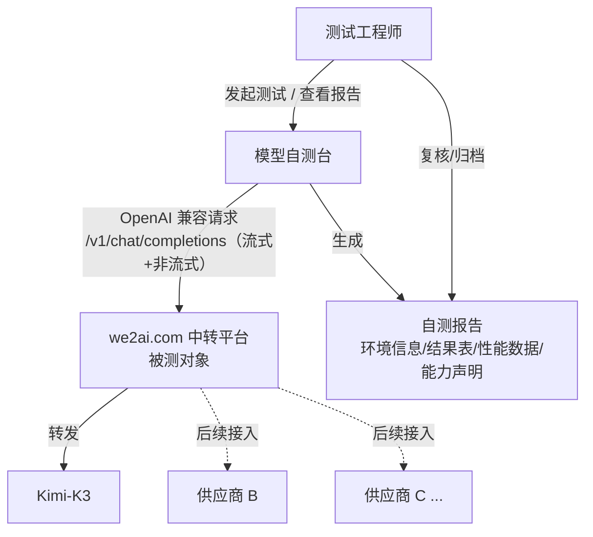
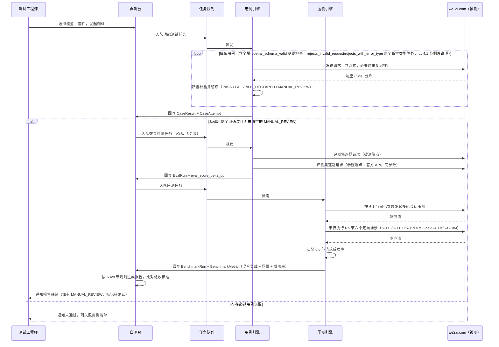

# 模型自测台 · 设计方案

> v0.6 · 已进入开发阶段，本版按新版验收要求重构性能/稳定性/效果验收口径
> 版权所有 © 2026 we2ai.com，由 we2ai.com 负责开发与维护
> 修订历史：
> - v0.2：Codex 逐条审核实际需求后，发现多处断言逻辑与实际需求检查点不符、性能数据模型缺字段、验收规则不可机器执行、首版技术栈范围过大，按审核意见逐条修订，实施路径改为「先跑通全部实际需求，再按需扩展」的最小路径。
> - v0.3：Fable 5 对 v0.2 做终审，发现三处规格层面问题——性能判定规则方向判反（导致优于基线的结果被误判 FAIL）、验收规则遗漏能力声明门禁、`CASE_RESULT` 无法承载多请求用例留痕——以及若干中低优先级口径缺口，本版逐条修复，详见第 15 节。
> - v0.4：对照代码库做验收审计（Claude 子代理初审 + Codex 复核），发现并修复以下文档-代码脱节：① Kimi-K3 套件「基础用例分母」已从实际需求原文 22 项增长到 26 项（v1.2.0 从 z-ai 套件回补 4 项协议基线加固用例），04.2/05/08 节写死的「22 项」改为「以套件定义 `counts_in_base22` 为准」；② 04 节新增 4.3 小节，补齐引擎已实现但文档遗漏的 8 种补充断言类型（`rejects_invalid_request`/`rejects_with_error_type`/`thinking_disabled_content_clean`/`no_prompt_echo`/`contains_all_substrings`/`self_judged_no_fabrication`/`long_context_recall`/`prompt_cache_hit_rate`），并在 4.1 节记录 `openai_schema_valid` 全局校验对前两者的场景性例外；③ 08 节规则 2 的文档定义（此前仅描述「已声明的可选能力」）与 `internal/report/verdict.go` 的实际实现（按 `counts_in_base22=false` 统一分组，不区分是否为能力声明）不一致，本版把文档口径改为与代码一致，并同步更新了 `verdict.go`/`render.go`/`template.go` 里引用旧口径的注释与报告文案；④ 03 节 ER 图字段与 `internal/model/model.go` 实际结构同步（`required_in_base22`→`counts_in_base22`、补齐 `CAPABILITY_PROFILE`/`CASE_ATTEMPT`/`CASE_RESULT`/`TEST_RUN`/`BENCHMARK_METRIC` 的遗漏字段、补充 `SUITE` 实体）；⑤ 05 节素材验证结论回填、视频体积边界用例超时数值订正为套件当前实际值 1800s。Codex 首轮复核后又发现更细的口径偏差，本版一并修复：规则 2 的完整性校验范围改为「套件定义中全部 `counts_in_base22=false` 用例，缺失结果判待确认、产出 FAIL 判不通过」（此前误写成「仅限已产出结果的用例」）；4.3 节 `thinking_disabled_content_clean`/`no_prompt_echo`/`long_context_recall` 三项描述收紧到与 `internal/assertion/assertion.go` 实际的启发式黑名单/前缀匹配/唯一数字串比对逻辑一致，不再用"任意思考痕迹""目标片段"等过宽措辞；09 节时序图标注 `openai_schema_valid` 的场景性例外；03 节 `CASE_RESULT` 显式列出 `case_attempts` 字段；`suites/kimi-k3/suite.v1.json` 的 description 改为声明"计数为编辑时快照，权威计数以 cases 数组统计为准"，不再自相矛盾地既写死数字又声称不重复维护。详见 05 节表格、「用例总数口径」段落与 08 节「规则 2 口径说明」。
> - v0.5：① 修复 `internal/engine/engine.go` 里 13 处硬编码调用 `openaiapi.ParseResponse`/`openaiapi.ValidateSchema`（未走 `e.parseResponse()`/`e.validateNonStreamSchema()` 协议分流）的历史遗留代码——涵盖 04.2 节 10 个核心 `score*` 断言函数及 `runThinkingTogglePair`/`runDeterministicMultimodalQA`/`runReasoningEffortScaling` 3 个多请求编排函数，另新增未按协议分流的流式分片校验 `validateStreamSchema`（原为包级函数，改为 `*Engine` 方法并接入分流）；问题此前是潜伏状态（仓库内还没有声明 `anthropic_messages` 风格的套件），修复后补充 `internal/engine/engine_anthropic_style_test.go` 三条回归测试防止再犯。② 10.2/10.3 节回填「历史对比」的实际完成状态：功能测试结果并排对比（`GET /api/test-runs/compare` + `/admin/compare` 页面）触发条件已满足并已补建，不再属于 P5 待办；压测指标历史趋势对比（供 6.2 节 Latency/ITL 判定使用）与多格式报告导出仍未实现，与前者严格区分，避免读者把两者混为一谈。
> - v0.6：按新版验收要求（效果 / 稳定性 / 性能 / 缓存四类阈值）重构验收口径：① 6.1 混合负载压测保留为吞吐门禁与分轮次缓存的数据来源，其 TTFT/TPOT/缓存命中率三行改为「仅记录」，不再承担验收门禁——混合负载下输入长度（avg 28.5K）与缓存状态不受控，无法对应「16K 无缓存 <4s」这类条件化阈值；② 新增 6.4 验收指标总表、6.5 定向性能场景（TTFT 16K/100K 无缓存、TPOT、缓存 95%/保持 1 分钟/保持 10 分钟共 6 个受控场景）、6.6 请求成功率口径、6.7 官方评测集效果对比；③ 08 节规则 3 扩展为「有验收阈值且可观测的性能/稳定性/效果指标」，门禁指标名以 6.4 表为准；④ 03 节 `BENCHMARK_METRIC` 补 `scenario/sample_count/invalid_samples/threshold` 字段，新增 `EVAL_RUN` 实体；⑤ 09 节时序补定向场景与效果评测阶段；⑥ 14 节新增 P6 阶段，逐步实现计划见 `docs/v0.6-验收指标实现计划.md`；⑦ 被测对象由 tokenpanel（49.233.9.153）改为 we2ai.com 企业级模型中转服务平台，01/02/07/09/11/12/13 节的被测对象描述同步替换，`Model.endpoint_via_tokenpanel` 字段名沿用不改、只改语义注释，`reports/` 下历史报告仍保留 tokenpanel 时期的数据不追溯修改。本版只改文档口径，代码尚未实现，实现状态以 P6 各步验收为准。
> 面向多供应商 LLM 接入场景的自测执行与报告平台：以 Kimi-K3 套件为首个测试套件模板，对被测网关（we2ai.com）暴露的 OpenAI 兼容接口执行功能与性能自测，产出符合验收要求的自测报告，并支持后续供应商按能力声明复用/扩展套件。

- **被测对象**：we2ai.com 企业级模型中转服务平台（OpenAI 兼容网关；v0.6 起替换原 tokenpanel · 49.233.9.153）
- **首期部署**：本地 / 独立环境
- **技术栈**：Go 后端 + `docs/sample/horizon-next-1.0.0`（Horizon UI，Next.js 15 + React 19 + Tailwind 后台模板）

---

## 目录

1. [系统定位与范围](#01-系统定位与范围)
2. [总体架构](#02-总体架构)
3. [数据模型](#03-数据模型)
4. [功能用例引擎](#04-功能用例引擎)
5. [Kimi-K3 用例目录](#05-kimi-k3-用例目录首个套件模板)
6. [压测引擎](#06-压测引擎)
7. [新供应商接入 SOP](#07-新供应商接入-sop)
8. [报告生成](#08-报告生成)
9. [执行时序](#09-执行时序)
10. [技术栈选型](#10-技术栈选型)
11. [与 we2ai.com 对接](#11-与-we2aicom-对接)
12. [安全与凭据管理](#12-安全与凭据管理)
13. [部署路线](#13-部署路线)
14. [实施里程碑](#14-实施里程碑)
15. [风险与待确认项](#15-风险与待确认项)

---

## 01 系统定位与范围

测试系统与 we2ai.com 是「测试台 → 被测系统 → 上游供应商」三层关系，不修改、不侵入 we2ai.com。



**范围边界**：本系统只做“黑盒调用 + 断言 + 压测 + 报告”，不接管 we2ai.com 的渠道配置、计费、鉴权体系；we2ai.com 侧的供应商接入（API Key、路由）仍由 we2ai.com 自身完成，测试台仅消费其已开通的模型端点。

---

## 02 总体架构

五个模块：控制台、调度 API、用例引擎、压测引擎、报告服务，围绕任务队列解耦，均通过标准 HTTP/SSE 调用被测网关。**这是目标架构**；首版实现方式见第 10 节（单进程、无队列），达到多用户并发等触发条件后再演进到本图的形态。


| 模块 | 职责 | 关键输入 | 关键输出 |
|---|---|---|---|
| Web 控制台 | 供应商/模型登记、套件选择、任务发起、结果查看、报告导出 | 用户操作 | 任务创建请求 |
| 调度 API | 任务生命周期管理、鉴权、任务入队、状态查询 | HTTP 请求 | Task 记录、队列消息 |
| 功能用例引擎 | 按套件逐条执行基础用例（数量以套件定义为准，见 05 节）+ reasoning_effort 附加用例 + 套件可能包含的其他补充用例（不计入基础分母，见 4.3/05 节）、断言校验、按能力声明跳过不适用项 | TestSuite + Model 能力声明 | CaseResult 逐条记录 |
| 压测引擎 | 包装 MTB Benchmark（或等价工具）执行爬坡压测，解析指标 | 压测参数模板 | BenchmarkMetric 明细 |
| 报告服务 | 汇总结果、比对验收标准、生成/导出报告、版本对比 | CaseResult + BenchmarkMetric | Report（HTML/PDF/MD） |

---

## 03 数据模型

核心是「供应商能力声明」驱动「用例是否适用」，「测试运行」串联功能结果与压测结果并归档为报告。**v0.3 变更**：新增 `CASE_ATTEMPT` 承载多请求用例（思考开关开/关、reasoning_effort 三档×N次）的逐次留痕；`CAPABILITY_PROFILE.thinking_toggle_methods` 明确为「声明支持的具体方式列表」而非描述性字符串；补全 `TEST_RUN`、`REPORT` 字段；`CASE_RESULT.status` 显式枚举取值。**v0.4 变更**：按 `internal/model/model.go` 实际实现回填字段——`TEST_CASE.required_in_base22` 改名为 `counts_in_base22`（与 03/04/05/08 节口径统一）；`CAPABILITY_PROFILE` 补 `context_window_tokens`/`max_output_tokens`/`prompt_cache`（z-ai 套件引入，kimi-k3 零值即未声明）；`CASE_ATTEMPT` 补 `metrics`/`passed`/`fail_reason`；`CASE_RESULT` 补 `case_id`/`counts_in_base22`；`BENCHMARK_METRIC` 补 `note`；`TEST_RUN` 补 `finished_at`/`case_results_path`/`benchmark_result_path`/`error_message`；新增 `SUITE` 实体承载 10.3 节描述的「套件定义存数据库」持久化记录。

```mermaid
erDiagram
  PROVIDER ||--o{ MODEL : "提供"
  MODEL ||--o{ CAPABILITY_PROFILE : "声明能力"
  TEST_SUITE ||--o{ TEST_CASE : "包含"
  SUITE ||--|| TEST_SUITE : "持久化记录（10.3 节）"
  MODEL ||--o{ TEST_RUN : "被测试"
  TEST_SUITE ||--o{ TEST_RUN : "用于"
  TEST_RUN ||--o{ CASE_RESULT : "产出"
  TEST_CASE ||--o{ CASE_RESULT : "对应实例"
  CASE_RESULT ||--o{ CASE_ATTEMPT : "包含尝试记录"
  TEST_RUN ||--o| BENCHMARK_RUN : "包含"
  BENCHMARK_RUN ||--o{ BENCHMARK_METRIC : "记录"
  TEST_RUN ||--o| EVAL_RUN : "包含（v0.6 效果评测）"
  TEST_RUN ||--|| REPORT : "生成"

  PROVIDER { string id PK
             string name
             string contact }
  MODEL { string id PK
          string provider_id FK
          string model_key
          string endpoint_via_tokenpanel "字段名沿用历史；v0.6 起存 we2ai.com 暴露的 OpenAI 兼容 base URL" }
  CAPABILITY_PROFILE { string model_id FK
                       bool image_url
                       bool image_base64
                       bool video_url
                       bool video_base64
                       bool tool_call
                       bool tool_choice_function
                       string[] thinking_toggle_methods
                       string default_thinking_behavior
                       bool reasoning_effort
                       int context_window_tokens "v0.4：z-ai 套件引入，long_context_recall 据此判断"
                       int max_output_tokens "v0.4：z-ai 套件引入，输入校验用例据此构造越界值"
                       bool prompt_cache "v0.4：z-ai 套件引入，声明是否提供上下文缓存" }
  TEST_CASE { string id PK
              string category
              bool counts_in_base22 "v0.4 改名，原 required_in_base22"
              string assertion_type
              string capability_tag
              int repeat_attempts }
  SUITE { string id PK
          string name
          text definition_json "完整 suite.vN.json 内容，v0.4 补充"
          bool has_materials "v0.4 补充"
          string created_at "v0.4 补充" }
  CASE_RESULT { string id PK
                string case_id FK "v0.4 补充：对应 TEST_CASE.id"
                string status
                int attempts
                int passed_attempts
                float pass_rate
                text fail_reason
                bool counts_in_base22 "v0.4 补充：冗余套件定义，见下方关键设计"
                "CaseAttempt[]" case_attempts "v0.4 补充：与 CASE_ATTEMPT 一对多关系（见上方 ||--o{ 关系线）在结构体里内联为切片字段，不是独立外键列" }
  CASE_ATTEMPT { string id PK
                 string case_result_id FK
                 int attempt_index
                 string variant_label
                 int http_status
                 int latency_ms
                 text request_body
                 text response_body
                 int reasoning_tokens
                 "map<string,float>" metrics "v0.4 补充：断言过程中的数值型观测量"
                 bool passed "v0.4 补充"
                 text fail_reason "v0.4 补充" }
  TEST_RUN { string id PK
             string model_id FK
             string suite_id FK
             string status
             string started_at
             string finished_at "v0.4 补充"
             string case_results_path "v0.4 补充：本地文件系统产物指针"
             string benchmark_result_path "v0.4 补充：本地文件系统产物指针"
             text error_message "v0.4 补充：执行过程本身出错（非业务判定失败）时记录" }
  REPORT { string id PK
           string test_run_id FK
           string generated_at
           string verdict
           text html_ref }
  BENCHMARK_RUN { string id PK
                  text raw_command
                  text raw_params_json
                  text tool_version
                  text dataset_version
                  text raw_stdout_ref
                  int total_requests
                  float duration_s }
  BENCHMARK_METRIC { string name
                     string scope
                     int round_index
                     float avg
                     float p50
                     float p75
                     float p90
                     float p95
                     float p99
                     string unit
                     string baseline_verdict
                     text note "v0.4 补充：来源缺失等场景的说明文字"
                     string scenario "v0.6：所属定向场景 ID（S-T16/S-C95 等），混合负载指标为空"
                     int sample_count "v0.6：参与统计的有效样本数"
                     int invalid_samples "v0.6：因前置条件不满足被剔除的样本数"
                     float threshold "v0.6：本指标验收阈值原值（如 4.0/0.94），供报告展示" }
  EVAL_RUN { string id PK
             string dataset_id
             string dataset_version
             string dataset_sha256
             int n_items
             float score_gateway
             float score_reference
             string reference_source "official_api_same_harness | published"
             float delta_pp "绝对差，百分点"
             float ci95_low
             float ci95_high
             text raw_results_ref "逐题结果 JSONL 引用" }
```

**关键设计**：

- `CAPABILITY_PROFILE` 是套件裁剪的依据，但不是无条件的 —— `image_base64` 与 `video_base64` 按实际需求「最少支持」要求视为**固定必过**，不允许在能力声明里标记为不支持；`image_url`、`video_url`、`tool_choice_function`、`reasoning_effort`，以及**思考开关的每一种具体方式**（`thinking_toggle_methods` 里未列出的方式）才是真正「视声明」可跳过的能力（对应 04 节的裁剪规则）。
- `CASE_RESULT` 是用例级汇总（状态/通过率），`CASE_ATTEMPT` 是请求级明细：一次 `usage_fields_stream`（尝试拿 usage 的两段式请求）、`thinking_toggle_pair`（开/关两次）、`reasoning_effort_scaling`（三档×N次重复采样）都会产出多条 `CASE_ATTEMPT`，`variant_label` 标注该次尝试对应「开/关」「low/high/max」等具体分支，`reasoning_tokens` 仅 reasoning_effort 用例填写。这解决了 v0.2 单一请求/响应体字段装不下多请求用例留痕的问题。
- `CASE_RESULT.status` 枚举取值：`PASS`（通过）/ `FAIL`（未通过，计入基础用例分母）/ `NOT_DECLARED`（能力未声明，标记 N/A，不计入基础用例分母）/ `MANUAL_REVIEW`（自动化无法下结论，独立于 PASS/FAIL 的第三态，直至人工确认后改写为 PASS 或 FAIL，见 04、06、08 节）。

---

## 04 功能用例引擎

用例定义与执行引擎分离：用例是数据（可随供应商差异增删），引擎只认识固定的一组断言类型。**v0.2 变更**：新增全局协议基线断言、修正 Default/auto 分支的误判风险、拆分流式/非流式 usage 校验、思考开关改为「开+关」成对校验、reasoning_effort 由 3 个独立用例合并为 1 个带聚合判定的用例、多模态引入人工复核态。**v0.3 变更**：`usage_fields_stream` 改为两段式尝试（不再强制要求供应商接受 `stream_options.include_usage` 参数）；思考开关未声明的具体方式按能力声明规则跳过；`tool_call_subset` 的从严解释显式标注；状态统一用 `CASE_RESULT.status` 枚举表达，不再用单独的布尔字段。

### 4.1 全局基线（叠加在每一条用例之上，不可跳过）

| 断言类型 | 校验逻辑 |
|---|---|
| openai_schema_valid | 响应字段名、层级、类型必须符合 OpenAI Chat Completions 规范（`id/object/created/model/choices[].message或delta/finish_reason` 等），流式场景对每个 chunk 结构做同样校验。任何用例若响应结构不合规，无论业务内容是否「看起来对」都直接判 FAIL —— 这是实际需求 2.1「协议一致性」的落地，此前版本遗漏了这条全局约束，可能出现结构错误但被业务断言误判通过的情况 |

> **例外（v0.4 补充记录）**：`rejects_invalid_request`/`rejects_with_error_type` 两个断言类型（见 4.3 节）的场景本身是「故意发送非法请求、期望网关返回 4xx 拒绝」，其响应（无论最终落在 4xx/5xx/被当合法请求处理的 2xx 哪个分支）都不执行 `openai_schema_valid`——4xx/5xx 错误响应体本就不是 Chat Completions 的正常响应结构，套用该 schema 没有意义；这两类用例改为完全依赖各自的状态码/错误体判定逻辑。这是「不可跳过」原则下的场景性例外，实现见 `internal/engine/engine.go` 的 `runRejectsInvalidRequest`/`runRejectsWithErrorType`（均未调用 `validateNonStreamSchema`）。

### 4.2 用例级断言类型

| 断言类型 | 校验逻辑 | 适用用例 |
|---|---|---|
| stream_integrity | SSE 分片数 ≥2，以 `[DONE]` 结束，中途无断流/网关截断 | Stream 完整性 |
| usage_fields_nonstream | `usage.prompt_tokens/completion_tokens/total_tokens` 均存在、非负、三者可加和自洽 | Usage 字段 · 非流式 |
| usage_fields_stream | 两段式：① 先不带 `stream_options.include_usage` 发起流式请求，检查最终 SSE 分片（`[DONE]` 前最后一包）是否自带合法 `usage`；② 若①未拿到，追加 `stream_options.include_usage` 重试一次，同样检查末包。两次尝试中任一成功即通过，均失败才 FAIL —— 避免把「原生尾包带 usage 但拒绝该参数」的网关误判为 FAIL（v0.2 曾强制要求参数生效，比实际需求原文「尾包或该参数」更严） | Usage 字段 · 流式 |
| content_nonempty | HTTP 200 且 `choices[0].message.content` 存在、trim 后非空。不做语义相关性判断——只要非空文本即算通过 | 连通性（不涉及工具调用的单轮场景） |
| text_or_tool_call | 响应满足「非空文本」或「合法 `tool_calls`（参数为可解析 JSON）」二选一，`content` 为 `null` 但存在合法 `tool_calls` 视为通过 | tool_choice 未传（Default）、`auto` |
| tool_call_required | 响应含 ≥1 条 `tool_calls`，且每条参数均为合法 JSON | 工具调用能力、tool_choice=required |
| tool_call_forbidden | 响应不含 `tool_calls`，仅文本 | tool_choice=none |
| tool_call_named | 调用的函数名与指定一致，且该次调用的参数为合法 JSON 并满足声明的 `parameters` schema | tool_choice=function（可豁免） |
| tool_call_subset | 请求提示词需保证「大概率触发调用」（复用工具调用能力用例的提示词模板）；断言调用次数 ≥1 且全部函数名 ⊆ `allowed_tools` 给定集合 —— 零次调用不再视为通过。**口径说明**：实际需求原文对 allowed_tools 只要求「在给定子集内选择」，未明确要求至少调用一次；「≥1 次」是本方案为避免空集合误通过而做的从严工程解释，如实际供应商对此有异议，可在能力声明里单独豁免 | tool_choice=allowed_tools |
| thinking_toggle_pair | 对同一开关方式发起两次请求（开 / 关各一次）：开启时必须含 `reasoning_content`（或等价字段），关闭时必须不含；两次都通过才算该用例通过 | 思考行为四种开关方式 |
| default_thinking_matches_declaration | 不传任何思考开关时的实际行为，需与 `CAPABILITY_PROFILE.default_thinking_behavior` 声明一致 | 默认思考行为 |
| json_schema_valid | 输出用给定 JSON Schema 做结构校验，零违规 | 结构化输出 · Schema |
| json_parseable | 输出可被标准 JSON 解析器无误解析 | 结构化输出 · Object |
| deterministic_multimodal_qa | 使用固定素材 + 有确定答案的问题（如「图中数字是几」）；能提取出可比对的答案时按 PASS/FAIL 判定，模型返回开放式描述、无法程序化比对时，状态置为 `MANUAL_REVIEW`（不计自动 PASS），报告中与 PASS/FAIL 分开展示 | 多模态四项（Image/Video × url/base64） |
| reasoning_effort_scaling | 单一逻辑用例，内部按 `repeat_attempts` 对 low/high/max 三档各重复请求 N 次（同一确定性问题，示例见实际需求 2.8），取每档 `reasoning_tokens` 的多数结果聚合；断言至少 low 与 high 存在可观测差异。聚合失败原因需在留痕中标明具体是哪两档无区分度 | reasoning_effort（low/high/max，合并为一条用例） |
| max_tokens_truncation（v0.4 新增） | `max_tokens` 强制截断三条同时成立：`finish_reason=="length"`、`usage.completion_tokens ∈ (0, max_tokens]`、`content` 非空；请求需显式关闭思考，避免思考 token 把输出预算吃光导致 `content` 为空 | 输出控制 · max_tokens 截断 |
| stop_sequence_respected（v0.4 新增） | 输出含约定的起始标记（证明模型确实开始作答）、不含指定的 `stop` 序列本身（必须被截断吞掉）、`finish_reason=="stop"` | 输出控制 · stop 语义 |
| deterministic_repeat（v0.4 新增） | 同一 `temperature=0` 且关闭思考的开放式问题连续请求 `repeat_attempts`（≥2）次，逐字节比对 `content`（不 trim），要求完全一致 | 确定性 · temperature=0 |

- **通过判定（基础用例）**：用例通过率 100% + HTTP 200 + `openai_schema_valid` 全部通过。基础用例的具体数量以套件定义中 `counts_in_base22=true` 的用例计数为准，不同套件/版本可能不同，不固定等于实际需求原文的 22（见 05 节「用例总数口径」）。
- **每用例强制留痕**：`CASE_ATTEMPT` 记录状态码 / 耗时 / 请求体&响应体（默认完整保留；经由 `runSingleNonStream`/`runSingleStream` 编排的多数单请求断言类型（`content_nonempty`/`tool_call_*`/`json_*`/`max_tokens_truncation`/`stop_sequence_respected`/`long_context_recall` 等），以及 `self_judged_no_fabrication`、`deterministic_repeat`、`prompt_cache_hit_rate`，支持用例在 `assertion_params.trace_body_max_chars` 声明截断上限；而 `rejects_invalid_request`、`rejects_with_error_type`、`usage_fields_stream`、`thinking_toggle_pair`、`deterministic_multimodal_qa`（多模态）、`reasoning_effort_scaling` 这几个断言类型目前固定走未截断的记录路径，恒定完整保留，尚未接入该截断能力——即使是体积较大的多模态素材也是如此），`CASE_RESULT` 记录 `attempts` 与 `passed_attempts`

能力相关用例先查 `CAPABILITY_PROFILE`：

- `image_base64`、`video_base64` 不允许标记不支持（实际需求最少支持项），未声明也按必过执行。
- `image_url`、`video_url`、`tool_choice_function`（对应 function 用例）、`reasoning_effort` 未声明 → 标记 `NOT_DECLARED` 并计入报告「能力声明与豁免说明」，不计入基础用例分母；已声明 → 必须 100% 通过，否则整体判定不通过。
- **思考行为分母口径（v0.3 明确）**：`CAPABILITY_PROFILE.thinking_toggle_methods` 是「声明支持的具体开关方式」列表，不是笼统的「支持其一即可」标记。声明列表里的每种方式对应用例都按**必过**处理；未列入声明的方式标记 `NOT_DECLARED`，不计入基础用例分母（与 `image_url` 等能力的处理方式一致）。约束：声明列表至少包含一种方式，否则视为能力声明本身不合法（校验时拒绝，不是测试时判失败）。`default_thinking_matches_declaration` 是独立必过项，不受此规则影响。

### 4.3 补充断言类型（v0.4 补充记录；不计入基础用例分母，实际需求之外按需扩展）

引擎除 4.2 节列出的、构成基础用例分母的断言类型外，还实现了以下 8 种断言类型，用于承载套件迭代过程中从真实测试（如《Kimi-K3-接口兼容性测试总结-0820.md》）发现的协议缺口、回归点。这些用例在套件定义里 `counts_in_base22` 均为 `false`，不参与 08 节 Rule1（基础用例）的判定，但只要在套件定义里存在，就整体参与 08 节 Rule2 的完整性校验——与 `required_rule` 取值无关，缺失结果同样判 `PENDING`（见 08 节「规则 2 口径说明」）。

| 断言类型 | 校验逻辑 |
|---|---|
| rejects_invalid_request | 故意发送非法请求，期望网关在网关层拦截并返回 4xx；返回 5xx（透传给后端触发服务端错误）或被当作合法请求处理（其余状态码）均判 FAIL |
| rejects_with_error_type | 判定前提同 `rejects_invalid_request`，额外在 4xx 响应体之上校验 `error.type`/`error.message`/`error.code` 结构是否规范（`expected_error_type` 参数默认 `invalid_request_error`） |
| thinking_disabled_content_clean | 思考显式关闭时：① `reasoning_content`（或等价字段）应为空；② `content` 不含已知的推理独白泄漏片段黑名单（如 "the user is asking"、"let me organize" 等固定英文短语，见 `reasoningLeakMarkers`）。这是启发式黑名单匹配，不是通用的"任意思考痕迹"检测，只能保证检出已发现的泄漏模式 |
| no_prompt_echo | 响应内容（trim 后）不应以 `assertion_params.prompt_text`（trim 后）的前 12 个字符为开头，用于检出"content = 用户原始 prompt + 模型输出"这种拼接性 bug。只比对前缀而非整段包含，避免模型合法复述/引用用户原话被误判 |
| contains_all_substrings | 响应内容必须同时包含 `assertion_params.required_substrings` 列出的全部子串 |
| self_judged_no_fabrication | 二段式：先正常发起用例请求（构造一个 tool 结果为空/null 的对话）拿到回复，再把回复原文喂给同一被测模型，让其自判是「请求澄清」还是「编造了具体数据」。已知局限：用被测模型自身当裁判存在「自证过审」偏差，PASS 不代表可跳过人工抽查，FAIL 的两段完整留痕更值得信任 |
| long_context_recall | 长上下文场景下两条独立证据缺一不可：① `usage.prompt_tokens ≥ assertion_params.min_prompt_tokens`，证明超长输入确实被完整送入而非被静默截断；② 从响应文本中提取出全部数字串后按**不同数字值**去重（重复出现的相同数字串只算一个），去重后的集合必须恰好只有一个值，且等于 `assertion_params.needle`——0 个（没找到任何数字）或 ≥2 个不同数字值都判 FAIL，但同一个正确数字重复出现多次不影响判定。不产出 `MANUAL_REVIEW`——数字答案没有需要人工判读的空间 |
| prompt_cache_hit_rate | 先发起 `assertion_params.warmup_requests`（默认 1）次预热请求，全部成功后再发一次正式请求，校验命中率是否达到 `assertion_params.min_hit_rate`（默认 0.5）门槛 |

---

## 05 Kimi-K3 用例目录（首个套件模板）

按实际需求原文逐项映射，作为「默认测试套件」种子数据，后续供应商可克隆后按能力声明增删。

**用例总数口径（v0.4 更新）**：基础用例分母不再固定等于实际需求原文的 22 项。实际需求原文 22 项之外，v1.2.0 从 z-ai 套件回补了 4 项跨供应商验证中发现有必要的协议基线加固用例（`output_control.max_tokens_truncation`、`output_control.stop_semantics`、`determinism.temperature_zero`、`thinking.reasoning_effort_off`，见 07 节 SOP「供应商专属指导文档，人工新增/调整差异用例」的扩展场景，这次是反向把 z-ai 验证出的通用协议缺口回补进 Kimi-K3 套件），Kimi-K3 套件当前基础用例分母为 **26 项**；另有 1 项合并后的 reasoning_effort 附加用例（内部含 low/high/max 三档，实际需求单独在 2.8 节和总览表按 3 项描述，本套件按「1 个用例、3 个判定分支」建模，报告中拆开展示三档结果但不计入基础用例分母）。**基础用例的准确数量以套件定义文件中 `counts_in_base22=true` 的用例计数为准**，不同套件、同一套件不同版本可能不同，本文档不再写死具体数字；下表列出的 26 行是 Kimi-K3 套件（`suites/kimi-k3/suite.v1.json`）当前实际配置。

| 类别 | 用例 | 判定 | 断言类型 |
|---|---|---|---|
| 协议完整性 | Stream 完整性 | 必过 | stream_integrity |
| 协议完整性 | Usage 字段 · 非流式 | 必过 | usage_fields_nonstream |
| 协议完整性 | Usage 字段 · 流式 | 必过 | usage_fields_stream |
| 多模态图像 | Image_url | 视声明 | deterministic_multimodal_qa |
| 多模态图像 | Image_base64 | 固定必过（不可豁免） | deterministic_multimodal_qa |
| 多模态视频 | Video_url | 视声明 | deterministic_multimodal_qa |
| 多模态视频 | Video_base64 | 固定必过（不可豁免） | deterministic_multimodal_qa |
| 工具调用支持 | Tool Call 能力 | 必过 | tool_call_required |
| 工具调用检测 | Default（不传） | 必过 | text_or_tool_call |
| 工具调用检测 | auto | 必过 | text_or_tool_call |
| 工具调用检测 | required | 必过 | tool_call_required |
| 工具调用检测 | none | 必过 | tool_call_forbidden |
| 工具调用检测 | function（强制指定） | 可豁免 | tool_call_named |
| 工具调用检测 | allowed_tools | 必过 | tool_call_subset |
| 思考行为 | enable_thinking（开+关） | 视声明（声明则必过） | thinking_toggle_pair |
| 思考行为 | thinking.type（开+关） | 视声明（声明则必过） | thinking_toggle_pair |
| 思考行为 | chat_template_kwargs.enable_thinking（开+关） | 视声明（声明则必过） | thinking_toggle_pair |
| 思考行为 | chat_template_kwargs.thinking（开+关） | 视声明（声明则必过） | thinking_toggle_pair |
| 思考行为 | 默认思考行为 | 必过（与声明一致） | default_thinking_matches_declaration |
| 结构化输出 | JSON Schema | 必过 | json_schema_valid |
| 结构化输出 | JSON Object | 必过 | json_parseable |
| 连通性 | 基础单轮请求 | 必过 | content_nonempty |
| 输出控制（v0.4 新增，v1.2.0 从 z-ai 套件回补） | max_tokens 强制截断 | 必过 | max_tokens_truncation |
| 输出控制（v0.4 新增，v1.2.0 从 z-ai 套件回补） | stop 语义 | 必过 | stop_sequence_respected |
| 确定性（v0.4 新增，v1.2.0 从 z-ai 套件回补） | temperature=0 | 必过 | deterministic_repeat |
| 思考行为（v0.4 新增，v1.2.0 从 z-ai 套件回补） | reasoning_effort（开+关） | 视声明（声明则必过） | thinking_toggle_pair |
| reasoning_effort（附加，不计入基础用例分母） | low / high / max 综合判定 | 视声明 | reasoning_effort_scaling |

> **已知超时风险**：实际需求明确多模态用例耗时可达数十秒级 —— 用例引擎的单请求超时需可按类别单独配置（多模态类目建议 ≥90s），不能沿用连通性类用例的短超时。
>
> **实际需求内部口径提示**：
> - 实际需求总览表把 `reasoning_effort` 标「是」（必过），但 2.8 节正文与第四节验收标准都写「若支持」「可豁免」；本方案采用 2.8 节/第四节的「视声明」口径，此处明确记录该解释，不代表两处表述已在实际需求原文中自洽。
> - 实际需求总览表对思考行为写「支持其中一种就可以」，但 2.5 节正文写「需验证以下开关均能正确控制」；本方案采用总览表的「其一即可」口径，并按 04 节的能力声明规则落地（声明的方式必过，未声明的方式记 `NOT_DECLARED`），同样明确记录该解释（v0.3 补充，此前版本对这处口径冲突未留痕）。

> **素材准备（v0.3 补充，结论已在 v0.4 回填）**：`deterministic_multimodal_qa` 依赖的固定图像/视频素材需要稳定可达的托管地址（`image_url`/`video_url` 场景）；`video_base64` 的载荷体积可能触及网关请求体上限，需提前验证。素材的选定、托管、版本冻结属于 P0「冻结验收清单」的一部分，不能留到 P2 才现找。**验证结论**：已用 `suites/kimi-k3/suite.v1.json` 中 `input_validation.video_base64_size_boundary_under_50mb`（约 48MB）/ `_over_50mb`（约 52MB）两个补充用例（不计入基础用例分母）验证，官方网关两档均返回 200；曾观测到内部网关笼统返回 429 或传输层超时——先放宽到 180s 仍不够（we2ai 渠道实测服务端耗时 110~205s），进一步放宽到 1800s（30 分钟）给传输层足够裕量，`repeat_attempts=3`（3 次全部成功才判 PASS），素材生成脚本见 `suites/kimi-k3/materials/generate_video_size_boundary.py`。

---

## 06 压测引擎

不重新发明爬坡压测算法：包装实际需求指定的 MTB Benchmark（或等价工具）作为执行内核，压测引擎只负责参数装配、进程编排与指标回填。**v0.2 变更**：压测参数从「遵循实际需求分布」改为逐项固化的可执行配置；性能判定规则改为可机器执行的比值区间；数据模型扩展到能装下实际需求的全部指标；补充原始产物留存要求。**v0.3 变更**：修正 v0.2 判定规则的方向性错误——原「实测÷基线 ∈ [0.5, 2]」是双向区间，会把优于基线的结果（如 TTFT 远快于 15s）误判 FAIL，改为单向规则（好的方向不设限，只约束劣化方向）；Latency/ITL 的判定不再依赖首版尚未建设的历史对比能力；缓存命中率的「硬门禁」与「来源未确认」之间补一条兜底规则。**v0.6 变更**：验收阈值改为 6.4 表的四类新要求；6.1/6.2 的混合负载压测降级为「吞吐门禁 + 其余指标仅记录」，TTFT/TPOT/缓存命中率的门禁转移到 6.5 的受控定向场景；新增 6.6 请求成功率、6.7 官方评测集效果对比两项门禁。

### 6.1 压测参数（实际需求 3.1 原文数值，逐项固化）

> 实际需求标题「平均 32k 输入和 300 输出」是场景的近似描述，不是执行参数；实际执行必须使用下表的完整分布，`32k/300` 仅作为报告摘要的口语化说明保留。

| 参数 | 取值（实际需求原文） |
|---|---|
| arrival-rate-start / arrival-rate-end / ramp-duration-seconds | 0.08 → 1，600s 内爬坡 |
| num-rounds | avg=30.2, p50=25.0, p75=34.0, p90=47.0, p95=57.0 |
| turn-interval | avg=18.6, p50=4.0, p75=10.0, p90=35.0, p95=86.0 |
| init-prompt-length | avg=28568.9, p50=21983.0, p95=74262.9 |
| input-length | avg=1352.6, p50=493.0, p95=4740.0 |
| output-length | avg=345.8, p50=68.0, p95=1514.0 |
| total-sessions | 按目标并发设定（供应商/we2ai.com 侧约定） |
| 数据集 | ShareGPT 类多轮对话数据 |

### 6.2 回传指标、基线与可执行判定规则

> **判定方向说明（v0.3 修正）**：实际需求的基线全部是单向约束——吞吐「越高越好」，TTFT/TPOT「越低越好」，实际需求原话是「与基线同一数量级、无明显劣化」，从未要求「不能比基线更好」。v0.2 曾用双向比值区间 `[0.5, 2]` 判定，会把明显优于基线的结果误判 FAIL，此处改为单向规则：达到或优于基线直接通过；劣于基线时，允许劣化到基线的 `MAX_DEGRADE_RATIO`（默认 2×，可配置）以内记「同一数量级」，超出记 FAIL。

| 回传指标 | 实际需求参考基线 | 判定规则 |
|---|---|---|
| Total requests / Duration | — | 仅记录，无判定 |
| Throughput（req/s、输入 tok/s、输出 tok/s） | req/s ≥ 0.6 | 实测 ≥ 0.6 直接通过；实测 < 0.6 时，`0.6 ÷ 实测 ≤ 2` 记「同一数量级」，否则 FAIL |
| TTFT（avg/p50/p75/p90/p95/p99） | 原 3.1 基线 P50 ≤ 15s（v0.6 起不作门禁） | 混合负载下仅记录全部分位，`baseline_verdict=NOT_APPLICABLE`；验收门禁由 6.5 场景 S-T16 / S-T100 承担 |
| TPOT（avg + 各分位） | 原 3.1 基线 P50 < 35ms（v0.6 起不作门禁） | 混合负载下仅记录，`NOT_APPLICABLE`；验收门禁由 6.5 场景 S-TPOT 承担 |
| Latency（avg + 各分位） | 无实际需求基线 | 首版无历史数据可比：仅记录数值，状态置为 `MANUAL_REVIEW`；待 10.2 节历史对比能力上线后，改为与该模型历史 `TEST_RUN` 对比，人工判断「有无明显劣化」 |
| ITL（avg + 各分位） | 无实际需求基线 | 同 Latency，首版仅记录 + `MANUAL_REVIEW` |
| 缓存命中率（整体 + 分轮次） | 原 3.1 基线稳态 ≥ 60%（v0.6 起不作门禁） | 混合负载下仅记录：剔除首轮（Round 0）后的稳态轮次均值 + 分轮次值，`NOT_APPLICABLE`；验收门禁由 6.5 场景 S-C95 / S-C1M / S-C10M 承担。**兜底规则**（对 6.5 三个缓存场景同样生效）：若确认 `cached_tokens` 在现有接口中不可观测，则相关指标**移出**验收结论规则 3 的门禁范围，报告中显式标注「未在现有接口中找到可观测来源，不纳入验收判定」，不得因缺失数据直接判 FAIL，也不得默认判 PASS |

### 6.3 完整性与留存要求

`BENCHMARK_RUN` 必须落盘：原始压测命令行（`raw_command`）、完整参数 JSON、MTB（或等价工具）版本号、数据集版本、stdout/stderr 全量日志引用。报告「完整 Benchmark 输出」章节直接引用这些原始产物，而不是只展示解析后的汇总指标，保证结果可复核。

首版压测任务用互斥锁保证同一时刻只有一个压测在执行（不与功能用例引擎共享执行体），避免相互抢占导致 TTFT 数据失真；「压测/用例双 Worker 独立扩缩容」是后续按需引入项，见第 10 节。

### 6.4 验收指标总表（v0.6，四类新要求的可执行落地）

| 类别 | 指标 | 阈值（原文） | 数据来源 | 门禁指标名（`BENCHMARK_METRIC.name`） | 判定 | 最小有效样本 |
|---|---|---|---|---|---|---|
| 效果 | 官方评测集得分差异（被测网关 vs 参照） | 无显著差异，< 3% | 6.7 效果评测 E-OFFICIAL | `eval_score_delta_pp` | Δ < 3 个百分点 OK；≥ 3 FAIL | 500 题（建议 ≥ 1000） |
| 稳定性 | 请求成功率 | ≥ 99% | 6.6，压测阶段全部请求 | `request_success_rate` | ≥ 0.99 OK；< 0.99 FAIL | 300 次请求 |
| 性能 | TTFT · 16K 输入 · 无缓存 | 平均 < 4s | 6.5 场景 S-T16 | `ttft_16k_nocache` | avg < 4.0s OK；≥ 4.0s FAIL | 10 |
| 性能 | TTFT · 100K 输入 · 无缓存 | 平均 < 7s | 6.5 场景 S-T100 | `ttft_100k_nocache` | avg < 7.0s OK；≥ 7.0s FAIL | 5 |
| 性能 | TPOT | < 20ms | 6.5 场景 S-TPOT | `tpot_long_output` | avg < 20ms OK；≥ 20ms FAIL | 10 |
| 缓存 | 预期 95% 缓存 | 实际缓存率 ≥ 94% | 6.5 场景 S-C95 | `cache_hit_expected95` | avg ≥ 0.94 OK；< 0.94 FAIL | 5 |
| 缓存 | 缓存保持 1 分钟 | 实际缓存率 ≥ 94% | 6.5 场景 S-C1M | `cache_keep_1min` | avg ≥ 0.94 OK；< 0.94 FAIL | 3 组 |
| 缓存 | 缓存保持 10 分钟 | 实际缓存率 ≥ 80% | 6.5 场景 S-C10M | `cache_keep_10min` | avg ≥ 0.80 OK；< 0.80 FAIL | 3 组 |
| 吞吐（沿用） | throughput_req_s | ≥ 0.6 req/s | 6.1 混合负载 | `throughput_req_s` | 沿用 6.2 单向规则（含 `MAX_DEGRADE_RATIO` 宽容带） | — |

**判定通则**：

1. v0.6 新增八项均为**硬阈值**，不套用 `MAX_DEGRADE_RATIO` 的「同一数量级」宽容带；该宽容带只保留给沿用的吞吐指标。判定值取 `avg`（原文写「平均」），`p50/p95` 一律记录不判定。
2. 有效样本数低于「最小有效样本」→ 该指标 `PENDING`（不 FAIL、不 PASS），总体结论锁定为待确认。
3. 「无缓存」「95%」「保持 N 分钟」等前置条件由 6.5 的有效样本规则逐样本校验；不满足的样本剔除并计入 `invalid_samples`，剔除比例 > 20% → `PENDING` 并在 note 里给出剔除原因分布。
4. `cached_tokens` 不可观测 → 三个缓存场景按 6.2 兜底规则记 `NOT_OBSERVABLE`，移出门禁并在报告标注；TTFT/TPOT 场景不依赖该字段，仍正常判定（无缓存由 nonce 构造保证，`cached_tokens` 只是交叉校验）。
5. 「3%」按**绝对百分点**解释（80.0% 与 77.1% 之间 Δ=2.9 通过）。若需按相对值解释（77.6% 才通过）需在 15.2 节决策后改 `evalset` 判定函数一处常量，其余不变。

### 6.5 定向性能场景（TTFT / TPOT / 缓存三类，共 6 个受控场景）

**公共约定**：

- 每个场景是 `BENCHMARK_RUN` 下的一个独立 `scenario`，在 6.1 混合负载压测**结束后串行执行**（并发 1），互不干扰；各场景请求均 `stream=true`（TTFT/TPOT 只能在流式下测）、`temperature=0`、显式关闭思考（避免 `reasoning_content` 先于 `content` 到达导致 TTFT 口径漂移）。
- **无缓存构造**：每个请求的第一条 message 最前面插入唯一 nonce 段（`[nonce:<uuid>]` + 随机文本 ≥ 64 token），使任何前缀缓存都无法命中；再用 `usage` 里的 `cached_tokens` 交叉校验，观测到 `cached_tokens > 1% × prompt_tokens` 的样本判无效。
- **输入长度校准**：填充文本按目标 token 数生成，样本 `usage.prompt_tokens` 必须落在目标 ±10% 内，否则无效；场景开始时先发 1 次校准请求测量「字符数 / token 数」比值并据此调整填充量，校准请求不计入样本。
- TTFT 定义沿用现有实现：请求发出到首个**非空 `delta.content`** 分片到达；TPOT 定义：`(完成时刻 − 首内容分片时刻) / (completion_tokens − 1)`。

| 场景 ID | 构造 | 样本量（目标 / 最小） | 指标与阈值 | 有效样本规则 |
|---|---|---|---|---|
| S-T16 · TTFT 16K 无缓存 | nonce + 约 16K token 分段随机文本 + 一句短问题；`max_tokens=64` | 20 / 10 | `ttft_16k_nocache`：avg < 4s | `prompt_tokens ∈ [14.4K, 17.6K]`；`cached_tokens ≤ 1%`；观测到首个非空 content 分片 |
| S-T100 · TTFT 100K 无缓存 | 同上，约 100K token；模型 `CAPABILITY_PROFILE.context_window_tokens < 110K` 时场景不执行，记 `NOT_OBSERVABLE` 并注明「模型上下文窗口不足」 | 10 / 5 | `ttft_100k_nocache`：avg < 7s | `prompt_tokens ∈ [90K, 110K]`；其余同 S-T16 |
| S-TPOT · 长输出 TPOT | nonce + 约 1K token 输入，提示词要求连续生成 ≥ 600 词说明文，`max_tokens=1024` | 20 / 10 | `tpot_long_output`：avg < 20ms | `completion_tokens ≥ 256`；非空 content 分片数 ≥ 32；`完成时刻 − 首内容分片时刻 ≥ 0.5s`——排除「整段一次性突发返回」的假流式样本（kimi-k3 官方 API 报告已观测到 TPOT 0.009ms 的双峰假象） |
| S-C95 · 预期 95% 缓存 | 共享前缀 P（约 16K token，含本场景唯一 nonce）+ 每次不同的短后缀 s_i（≤ 5% token）。步骤：① 单独发 s_0 测后缀 token 数（校准）；② 预热 1 次 P+s_0；③ 间隔 2s 依次发 P+s_1 … P+s_N | 10 / 5 | `cache_hit_expected95`：hit_i = `cached_tokens / prompt_tokens`，avg ≥ 0.94 | 校准得到 `P / (P + s) ≥ 0.95`，否则场景配置无效 → `PENDING`；`cached_tokens` 未观测 → `NOT_OBSERVABLE` |
| S-C1M · 缓存保持 1 分钟 | K 组互不相同的前缀 P_k（各含唯一 nonce，约 16K token）；每组：预热 1 次 → 静默 60s（期间不发任何含 P_k 的请求）→ 探测 1 次 | 3 组 / 3 组 | `cache_keep_1min`：avg(hit_k) ≥ 0.94 | 探测请求 `prompt_tokens` 与预热一致（±2%）；`cached_tokens` 未观测 → `NOT_OBSERVABLE` |
| S-C10M · 缓存保持 10 分钟 | 同 S-C1M，静默 600s；K 组**并行**等待（前缀互不相同、互不影响），场景总耗时约 10.5 分钟 | 3 组 / 3 组 | `cache_keep_10min`：avg(hit_k) ≥ 0.80 | 同 S-C1M |

**单次运行的输入 token 预算**（按目标样本量估算，用于成本核对）：S-T16 ≈ 0.34M、S-T100 ≈ 1.0M、S-TPOT ≈ 0.02M、S-C95 ≈ 0.2M、S-C1M + S-C10M ≈ 0.2M，合计约 1.8M 输入 token，其中约 1.2M 为无缓存计费；总耗时约 15–20 分钟（S-C10M 占 10.5 分钟，可与 S-T100 并行以缩短，但 S-T100 期间不得有其他请求争抢，默认不并行）。

### 6.6 稳定性：请求成功率口径

| 项 | 定义 |
|---|---|
| 分母 | 同一 `TEST_RUN` 内压测阶段发出的**全部请求**：6.1 混合负载 + 6.5 六个场景（含校准、预热、探测请求）。功能用例阶段不计入——其中含故意非法请求、素材体积边界等语义不同的请求；功能阶段的成功率单独记录不做门禁 |
| 分子 | HTTP 2xx，且响应体可解析，且流式收到 `[DONE]`（非流式为完整 JSON），且在场景超时内完成 |
| 重试 | 只计**首次尝试**；压测/场景引擎不做自动重试，重试成功不改写首次失败 |
| 门禁 | `request_success_rate = 分子 / 分母 ≥ 0.99`；分母 < 300 → `PENDING` |
| 留痕 | 失败按「超时 / 5xx / 4xx / 断流 / 解析失败」五类分组，按场景统计，写入指标 note 与报告「稳定性」小节 |

### 6.7 效果评测：官方评测集对比（场景 E-OFFICIAL）

| 项 | 定义 |
|---|---|
| 评测集 | 供应商官方公布的评测集（或其公开子集）落成 `datasets/<dataset_id>/<version>.jsonl`，每行 `id / messages / expected / scorer / scorer_params`；版本冻结并记录 `sha256`，同一 `EVAL_RUN` 内两端用同一文件 |
| 参照分来源 | 默认 `official_api_same_harness`：**同一评测程序、同一参数、同一题集**跑供应商官方 API 端点得到的分数。供应商公布的分数只作报告参考列（`published`），不作判定参照——不同评测框架的提示词与答案解析差异本身经常超过 3 个百分点 |
| 打分器 | `exact_match`（归一化后全等）/ `choice`（提取选项字母）/ `numeric`（数值容差）/ `contains`（包含目标子串）；输出解析失败记 0 分并单列「解析失败」计数 |
| 请求参数 | `temperature=0`、思考按评测集要求固定（默认关闭）、`max_tokens` 固定，两端**逐字段一致**；并发 ≤ 4，逐题留痕请求/响应 |
| 判定 | `delta_pp = abs(score_gateway − score_reference) × 100`（绝对百分点）；< 3 OK；≥ 3 FAIL；`n_items < 500` 或参照分缺失 → `PENDING` |
| 统计提示 | n=500、准确率约 80% 时，两比例差的标准误约 2.5 个百分点，与 3 的阈值同量级；建议 n ≥ 1000。判定只看点估计（对应原文「小于 3%」），报告同时给出两比例差的 95% 置信区间与逐题不一致清单，供人工判断「显著性」 |
| 执行位置 | 独立阶段 `RUNNING_EVAL`，在功能测试通过后、混合负载压测之前执行（评测题目短、对压测无干扰；先跑可尽早暴露效果回退）；产出 `EVAL_RUN` 一行 + 指标行 `eval_score_delta_pp`（Scope=`overall`）供 08 节规则 3 消费 |

---

## 07 新供应商接入 SOP

Kimi-K3 只是第一个套件实例；新增供应商不写新代码，只走以下登记流程。

1. **we2ai.com 侧完成渠道接入** — 运营人员在 we2ai.com 后台配置好新供应商的上游 Key、路由，产出可用的模型 ID + 测试用 API Key。
2. **测试台登记供应商与模型** — 在 Web 控制台创建 Provider/Model 记录，填写 `CAPABILITY_PROFILE`（image_url/image_base64/video_url/video_base64/工具调用/思考开关方式/reasoning_effort 等，base64 两项不可标记为不支持）。
3. **克隆测试套件** — 默认继承 Kimi-K3 套件；引擎按能力声明自动裁剪，不需要人工逐条勾选用例。若供应商有专属指导文档，人工新增/调整差异用例。
4. **运行功能测试** — 全部「必过」用例 100% 通过后，压测任务自动解锁；任一必过项失败或存在未清空的 `MANUAL_REVIEW` 状态则整体判定不通过，阻断压测。
5. **运行压测并生成报告** — 系统按 6.2 节规则自动比对基线，产出符合实际需求第四节格式的报告，人工复核能力声明、豁免说明与所有 `MANUAL_REVIEW` 项后归档。

---

## 08 报告生成

报告结构严格对齐实际需求「四、结果回传要求」，系统自动生成而非人工誊抄。**v0.2 变更**：明确用例计数分母、逐条通过率的取数方式、新增「需人工复核」展示态、验收结论改为四条机器可执行的规则。**v0.3 变更**：修复验收规则遗漏「声明能力必须全过」门禁的漏洞；功能结果表明确引用 `CASE_ATTEMPT` 展示多请求用例的逐次明细。

| 报告章节 | 数据来源 | 自动化程度 |
|---|---|---|
| 环境信息（模型 ID、API 端点、测试日期） | TEST_RUN 元数据 | 全自动 |
| 功能测试结果表（基础用例逐条：`passed_attempts/attempts` 通过率、HTTP状态、耗时、结论；多请求用例展开 `CASE_ATTEMPT` 逐次明细）+ `counts_in_base22=false` 且状态非 `NOT_DECLARED` 的附加/补充用例（含 reasoning_effort 的各档 `reasoning_tokens`）共用一个「附加/补充用例结果」章节；状态为 `NOT_DECLARED` 的用例改归入「能力声明与豁免说明」章节，不与「附加/补充用例结果」重复展示 | CASE_RESULT + CASE_ATTEMPT | 全自动；失败项自动附请求体/响应体/失败原因；`MANUAL_REVIEW` 项单独高亮，不计入自动 PASS |
| 性能测试结果（混合负载：Total requests/Duration、吞吐、TTFT/Latency/TPOT/ITL 全分位、整体+分轮次缓存命中率；**v0.6 定向场景**：6.5 六个场景各自的 avg/p50/p95、有效/无效样本数、阈值与判定；**稳定性**：6.6 成功率与失败分类；原始命令与日志引用） | BENCHMARK_RUN + BENCHMARK_METRIC | 全自动；Latency/ITL 及缓存命中率来源不明时显式标注，不臆造判定；场景 `PENDING` 时列出样本不足/剔除原因 |
| 效果评测（评测集名称与版本、题数、被测分 / 参照分 / 公布分、Δ 百分点、95% 置信区间、不一致题目清单） | EVAL_RUN + 逐题结果 JSONL | 全自动；参照分缺失时标注「未执行参照跑」，不与公布分做判定 |
| 能力声明与豁免说明 | CAPABILITY_PROFILE + NOT_DECLARED 用例列表 | 自动生成草稿，人工复核确认 |
| 验收结论（`PASS`/`FAIL`/`PENDING_MANUAL_REVIEW` 三态） | 四条规则自动判定（见下） | 全自动，`MANUAL_REVIEW` 未清空前总体结论锁定为「待人工确认」（`PENDING_MANUAL_REVIEW`） |

**验收结论四条规则**（对应实际需求第四节，改写为可执行判定）：

1. 基础用例（`counts_in_base22=true`，数量以套件定义为准，见 05 节）通过率 100%（`MANUAL_REVIEW` 状态视为未通过，直至人工确认改写为 PASS/FAIL）。
2. 套件定义中全部「不计入基础用例分母」的用例（`counts_in_base22=false`）都纳入完整性校验：缺失结果（从未执行）判待确认；产出结果的状态必须是 `PASS` 或 `NOT_DECLARED`，`FAIL` 直接判不通过，`MANUAL_REVIEW` 视为待确认（v0.4 修订，见下方口径说明）。
3. 有验收阈值且可观测的性能 / 稳定性 / 效果指标实测值满足 6.4 表的判定。门禁指标名清单以 6.4 表为准（`throughput_req_s`、`ttft_16k_nocache`、`ttft_100k_nocache`、`tpot_long_output`、`cache_hit_expected95`、`cache_keep_1min`、`cache_keep_10min`、`request_success_rate`、`eval_score_delta_pp`）；`NOT_OBSERVABLE` 按 6.2 节兜底规则移出门禁，`PENDING`（样本不足 / 前置条件不满足 / 参照缺失）拖累总体结论为待确认。**v0.6 变更**：此前门禁为吞吐、TTFT P50、TPOT P50、缓存命中率四项，后三项改由 6.5 定向场景承担。
4. **规则 1、2、3 任一失败即总体 FAIL**（v0.2 曾遗漏规则 2，导致声明能力失败时不会拖累总体结论，与实际需求「声明支持的能力，其对应用例必须全部通过」矛盾，v0.3 已修正）；规则 2 中标记 `NOT_DECLARED` 的用例不参与本条判定，只体现在豁免说明。

**规则 2 口径说明（v0.4 修订，Codex 复核后进一步订正）**：v0.3 版本把规则 2 表述为「已声明支持的可选能力（image_url/video_url/function/reasoning_effort/思考开关各方式）对应用例 100% 通过」，但 `internal/report/verdict.go` 的实现（`evalRules1And2`/`evalCaseGroup`）从一开始就是按套件定义的 `counts_in_base22` 统一分组，且完整性校验的范围是**套件定义里全部 `counts_in_base22=false` 的用例**，不局限于「已产出结果的用例」：
- 该分组里某条用例如果**从未产出结果**（套件定义了但没执行），判 `PENDING`（待确认），不是"不参与判定"；
- 产出结果后，`PASS`/`NOT_DECLARED` 视为通过，`FAIL` 直接判规则 2 不通过并拖累总体结论，`MANUAL_REVIEW`/无法识别的状态值判 `PENDING`。

这一组既包含「已声明能力用例」，也包含「供应商专属加固/回归用例」（如 04.3 节列出的、`counts_in_base22=false` 的补充断言类型用例）——不区分是否对应某项能力声明。这次审计确认该实现是有意为之且更符合质量把控目的（不能让已知的回归缺陷因为「不在实际需求原文 22 项里」就被排除在验收之外，也不能让套件里定义了但漏跑的补充用例被悄悄放过），因此本版把文档口径改为与代码一致，而不是收窄代码去匹配旧文档。

**导出格式**：首版仅 HTML（服务端渲染，可直接浏览器打印为 PDF）；同一模型多次 TEST_RUN 支持并排对比，用于「修复后重测」场景快速定位差异用例。专门的 PDF 生成管线、Markdown 导出属于后续按需引入项（见第 10 节）。

---

## 09 执行时序



---

## 10 技术栈选型

已指定：后端 Go，前端复用 `docs/sample/horizon-next-1.0.0`（Horizon UI，Next.js 15 + React 19 + Tailwind 后台模板）。**v0.2 变更**：按 Codex 审核意见收缩首版范围 —— 只保留「跑通全部实际需求」的硬需求，其余基础设施移到「后续按需引入」，避免过度设计拖慢首次交付。

### 10.1 首版最小集（P0–P4，目标：单人可用、能跑通实际需求全部功能与性能要求）

| 层 | 选型 | 理由 |
|---|---|---|
| API + 编排 | Go + Gin，单一进程内直接执行用例/压测任务（不引入任务队列） | 首版只需支持串行/低并发的自测任务，队列基础设施在此规模下是纯粹的额外维护成本 |
| SSE 消费 | net/http + bufio.Scanner 手工解析 `data:` 分片 | Go 标准库无内置 EventSource 客户端，需按行读取并识别 `[DONE]`，直接对应第 4 节 stream_integrity 断言 |
| 压测执行内核 | os/exec 包装外部 MTB Benchmark CLI（或第 15 节的自研等价压测器） | 不重复实现实际需求给定的爬坡/分布采样逻辑；Go 侧只做进程编排、stdout 解析与指标回填 |
| 数据 & 留痕存储 | SQLite（或已有的单机 PostgreSQL）+ 本地文件系统存请求/响应体与压测原始日志 | 单进程场景不需要 PostgreSQL 的多连接/JSONB 高级特性；换成 PostgreSQL 仅是切换驱动，不影响表结构 |
| 套件定义存储 | 套件定义 JSON（`suite.vN.json` 内容）存 SQLite `suites` 表；配套素材二进制文件（图片/视频等）单独放持久化目录 `MaterialsRoot`（Docker 下 `/data/materials`），静态文件服务直接读磁盘做不到存数据库 | Docker 部署下 `suites/` 目录是烧录进镜像的只读种子（`testbed-cli`/`report-cli` 两个独立 CLI 工具继续直接读它，不连数据库），api-server 启动时覆盖式同步进数据库；`/admin/suites` 页面创建/克隆出的套件只写数据库+`MaterialsRoot`，能在容器重建后保留，见 10.3 节 |
| 鉴权 | 固定 Token / Basic Auth，内网访问 | 首版单用户或小范围内网使用，JWT 体系是为多用户权限设计的，此刻没有对应需求 |
| 报告导出 | 服务端渲染 HTML，PDF 通过浏览器打印生成 | 满足实际需求第四节「提交一份自测报告」的最低要求，不需要专门的 PDF 生成管线 |
| 前端 | docs/sample/horizon-next-1.0.0（复用），首版只落地 4 个页面：模型登记、发起任务、结果详情、报告下载 | 复用模板骨架和组件，把范围压缩到验收实际需求的最小页面集 |

### 10.2 后续按需引入（不在首版做，触发条件明确后再评估）

| 组件 | 引入条件 |
|---|---|
| PostgreSQL（替换 SQLite） | 需要多供应商并行管理、多次归档查询的复杂检索能力时 |
| Redis + asynq（任务队列 / 多 Worker） | 出现多用户并发发起测试，或需要任务失败自动重试/断点恢复时 |
| JWT 鉴权体系 | 需要区分多用户角色权限时 |
| ~~套件克隆管理界面~~ | ~~真正接入第二个供应商、且套件差异化维护成本上升时~~ 触发条件已满足（suites/ 目录已有 kimi-k3、z-ai 两个套件），已补建为 `/admin/suites`，见 10.3 节 |
| ~~历史对比（功能测试结果，「修复后重测」场景）~~ | ~~出现高频重测对比需求时~~ 触发条件已满足（`reports/` 目录已积累大量人工手搓的多轮对比 md/html，如 P2-功能测试结果表-\*-对比.md），已补建为 `GET /api/test-runs/compare` + `/admin/compare` 页面：按 `case_id` 对齐 2~8 个同 `model_key`+`suite_id` 的 TestRun 并排展示（v0.5 补充记录，见 `internal/api/compare.go`）。**范围限定**：只对比 `CASE_RESULT`（功能测试结果），不含压测指标——下一行的压测历史趋势对比仍未实现 |
| 压测指标历史趋势对比（Latency/ITL 判定依据） | 6.2 节写"待此能力上线后，与该模型历史 TEST_RUN 对比，人工判断有无明显劣化"——**仍未实现**，Latency/ITL 首版占位（仅记录 + `MANUAL_REVIEW`）继续生效，不要被上一行的功能结果对比页面误导为已经满足 |
| 多格式报告导出（PDF/Markdown 等非 HTML） | 需要向外部系统提交非 HTML 格式报告时——**仍未实现**，首版仅 HTML（可浏览器打印） |
| 压测/用例引擎独立 Worker 扩缩容 | 需要压测与功能测试同时并发运行、且互相不能阻塞时 |

### 10.3 horizon-next 页面复用映射

模板自带 `app/admin/{default, data-tables, nft-marketplace, profile}` 与 `app/rtl/*` 示例页。目录级检查确认这些路径均存在，`routes.tsx`、`components/admin/data-tables/ComplexTable.tsx`（TanStack Table）、ApexCharts、Chakra Modal/Popover/Tooltip 组件齐备；但下表大部分业务路由仍是新页面，模板只提供了页面骨架和可复用组件，不是现成业务页：

| 路由 | 处理方式 | 首版范围 | 说明 |
|---|---|---|---|
| `/admin/providers` | 新增 | ✅ P0-P4 | 供应商/模型登记表单，复用 `components/fields` + Chakra Modal，对应 `CAPABILITY_PROFILE` 录入 |
| `/admin/test-runs/[id]`（发起任务 + 结果详情合并） | 新增 | ✅ P0-P4 | 复用 `ComplexTable.tsx` 承载用例结果表；失败请求/响应体查看器用 Chakra Modal/Popover 承载（模板未提供代码查看器，需新增） |
| `/admin/reports/[runId]` | 新增 | ✅ P0-P4 | HTML 报告展示 + 浏览器打印导出 |
| `/admin/suites`（套件管理） | 新增 | ✅ 后补 | 10.2 节"套件克隆管理界面"，suites/ 目录出现第二个供应商套件（z-ai）后触发引入条件而补建：列出/创建空白套件骨架/克隆已有套件（含素材文件与内部引用改写）。套件定义存 SQLite `suites` 表（Docker 部署下随 `/data/testbed.db` 持久化，不再是烧录进镜像、重建即丢的文件），素材二进制文件单独持久化在 `MaterialsRoot`（Docker 下 `/data/materials`）；`suites/` 目录本身降级为 git 跟踪的"种子"，api-server 启动时覆盖式同步进数据库，`testbed-cli`/`report-cli` 两个独立 CLI 工具继续直接读这份种子文件，不受影响。用例内容本身仍需人工编辑 JSON |
| `/admin`（原 default 仪表盘） | 改造复用 | 后续 | 替换 Widget 数据源为总览 KPI |
| `/admin/benchmark/[runId]`（独立于结果详情的图表页） | 新增 | 后续 | ApexCharts 折线图（TTFT/TPOT 分位）+ 面积图；首版先把压测指标并入 `/admin/test-runs/[id]` 的简单表格展示 |
| `/admin/reports`（报告列表） | 新增 | 后续 | 仅"列表"部分仍未做（没有浏览全部历史报告的入口页）；"历史对比"部分已通过独立路由 `/admin/compare` 实现，不在此路由下，见 10.2 节 |
| `/admin/compare`（历史对比，功能结果并排） | 新增 | ✅ 已补建 | 10.2 节"历史对比"触发条件已满足后补建，见该节说明；不含压测指标对比 |
| `/admin/profile` | 直接复用 | 视需要 | 目录级检查只能证明该页面文件存在，是否「无需改动」需在实际接入鉴权后验证 |
| `/admin/nft-marketplace`、`/app/rtl/*` | 删除 | — | 与本系统无关的模板示例页，保留只会增加维护负担 |

---

## 11 与 we2ai.com 对接

两种供应商/模型登记方式，首期建议走手动模式，不依赖未验证的 we2ai.com 管理 API。

- **方式 A · 手动登记（首期采用）**：运营人员在 we2ai.com 后台为待测模型开一个测试专用 API Key。Provider/Model 登记表单（`/admin/providers`）只录入 `CAPABILITY_PROFILE`，不收 API Key——Key 改为每次在「发起测试任务」页面（`/admin/test-runs/new`）按次手动输入，随请求提交给调度服务，不落库、不持久化，详见第 12 节。零依赖，当天可跑通；经审核确认这条路径不构成实现阻塞，见第 15 节。
- **方式 B · 自动同步（待验证后再做）**：若 we2ai.com 提供渠道/模型管理 API，可定时同步供应商-模型映射，减少人工维护。需先确认该 API 是否存在及其权限模型，移出首版范围。

> **未验证项**：本次设计未核实 we2ai.com 是否暴露渠道管理接口；如需探查其管理后台或使用任何生产凭据，需要你明确授权后再进行，不在本方案中默认执行。

---

## 12 安全与凭据管理

| 凭据类型 | 存储方式 | 访问范围 |
|---|---|---|
| we2ai.com 测试用 API Key | **首版简化：不持久化。** 每次「发起测试任务」时在前端表单临时输入，随请求体一次性传给调度服务用于发起本次任务，任务结束后不在数据库或日志中保留明文/密文。比应用层加密存储更简单、攻击面更小（无需密钥管理），代价是每次发起任务都要重新输入。后续若需要免重复输入，可再评估引入应用层加密存储（密钥与其他系统密钥分离，仅调度服务运行时进程可解密） | 仅当次请求的调度服务进程内存持有 |
| 请求体/响应体留痕 | 数据库 + 本地文件系统，供应商侧敏感信息（若含用户上传图片/视频 base64）设保留期，到期清理 | 报告服务只读，不落盘明文导出 |
| 生产服务器 SSH/DB 密码（.server.env） | 不进入本系统任何数据库或日志；仅作部署时的人工操作参考 | 人工，不在应用侧持久化 |

---

## 13 部署路线

首期本地/独立环境跑通，不与 we2ai.com 生产平台共用宿主机；验证稳定后再谈上线位置。

| 阶段 | 环境 | 验收标准 |
|---|---|---|
| 阶段 1 | 本地 docker-compose（单一 Go 二进制 + SQLite/单机 Postgres + Next.js） | Kimi-K3 套件对 we2ai.com 实际模型跑通全部用例与压测，报告可导出，对应第 14 节 P0-P4 |
| 阶段 2 | 独立测试服务器（不与 we2ai.com 生产环境同机） | 多人可访问；若并发需求出现，先按第 10.2 节触发条件引入队列/多 Worker 再上线 |
| 阶段 3（待定） | 视需要再评估是否接入生产反向代理 | 需重新走一次安全评审，本方案不预设此阶段的具体动作 |

---

## 14 实施里程碑

**v0.2 变更**：原 M0-M4（骨架 → 功能引擎 → 压测引擎 → 报告与套件复用 → 控制台完善）默认在第一阶段就引入队列/多 Worker/JWT，范围偏大；改为 Codex 建议的 P0-P5 最小路径，先用单进程实现跑通全部实际需求，再按 10.2 节的触发条件扩展。

| 阶段 | 目标与动作 | 输出 | 验收标准 |
|---|---|---|---|
| P0 · 冻结验收清单 | 把 05 节的用例目录落成一份版本化的套件定义（含每条用例的请求模板、断言类型、能力标签、必过规则、repeat_attempts）；同步选定多模态确定性素材（图像/视频，托管地址、体积、版本冻结） | 版本化套件定义文件 + 素材清单 | 实际需求中每个检查点都能一一映射到某条用例的请求/断言/报告行，无遗漏；多模态素材可稳定复现同一预期答案 |
| P1 · 无 UI 调用器 | 单个 Go 程序实现 HTTP/SSE 调用、留痕、`openai_schema_valid` 全局校验 + 04 节全部断言类型 | 可命令行执行的用例引擎 | 用固定 mock 响应跑正反例：结构错误、断流、非法工具参数、`content=null`+合法 tool_calls 等场景都能按预期 PASS/FAIL |
| P2 · 真实功能自测 | 手动配置 we2ai.com 测试端点/模型/Key/能力声明，顺序跑通全部基础用例 + reasoning_effort 附加用例 + 套件里的其他补充用例；多模态用 P0 冻结的确定性素材 | 可提交的功能测试结果表 | 必过项、声明项、`NOT_DECLARED`、`MANUAL_REVIEW`、失败原因和原始报文均可追溯 |
| P3 · 性能闭环 | 优先接 MTB Benchmark；若拿不到则按第 15 节启用自研等价压测器，落实 6.1 节固化参数与 6.2 节判定规则 | 完整 Benchmark 输出（含原始命令/日志） | 能回传 Total requests、Duration、三类吞吐、TTFT/Latency/TPOT/ITL 全分位、整体及分轮缓存命中率（或明确标注来源缺失） |
| P4 · 报告与最小 Web | 用同一份结果生成 HTML 报告；horizon-next 只落地模型登记、发起任务、结果详情、报告下载 4 个页面（对应 10.3 节首版范围） | HTML 报告 + 最小控制台 | 报告四章节齐全，失败项附证据，`MANUAL_REVIEW` 项状态清晰可见 |
| P5 · 按需扩展 | 出现 10.2 节列出的触发条件后，再引入 PostgreSQL、Redis/asynq、JWT、独立 Worker 扩缩容、压测指标历史趋势对比、多格式报告导出；套件克隆界面与功能测试结果历史对比（`/admin/compare`）触发条件已满足并已补建，不再属于本阶段待办 | 可运营平台 | 以真实的并发/恢复/权限/多供应商需求作为引入依据，不预先建设 |
| P6 · v0.6 验收指标落地 | 按 `docs/v0.6-验收指标实现计划.md` 分 6 步实施：① 数据模型与规则 3 门禁清单；② 场景框架 + 无缓存/长度校准公共件；③ S-T16/S-T100/S-TPOT；④ S-C95/S-C1M/S-C10M；⑤ 6.6 成功率；⑥ 6.7 效果评测（`internal/evalset` + 评测集文件 + 参照端点）；每步独立可合并、可用 mock 网关回归 | 6.4 表九项门禁全部产出指标行并进入报告 | 用 mockserver 构造「命中/未命中/突发假流式/样本不足」四类场景，规则 3 结论与 6.4 表逐项一致；真实端点跑一次完整 P6 流程并归档 |

---

## 15 风险与待确认项

### 15.1 已在本次修订中解决

| 项 | 发现于 | 问题 | 解决方式 |
|---|---|---|---|
| 被测平台管理 API 是否存在 | v0.1 | 曾作为待确认阻塞项 | 经审核确认**不构成阻塞**：功能与性能测试只需要可用 endpoint、模型 ID、测试 API Key；方式 A（手动登记）已足够支撑首版，见第 11 节 |
| reasoning_tokens 比较用例的确定性 | v0.1 | 三档各自独立判定，缺少聚合规则 | 合并为单一 `reasoning_effort_scaling` 断言，支持 `repeat_attempts` 重复采样取多数结果，见 04/05 节 |
| 断言逻辑与实际需求检查点不符（Default/auto 误判、tool_call_subset 空集合误通过、多模态无法自动判定等） | v0.1 | 见 v0.1 审核记录 | 已在 04 节逐条修正为 `text_or_tool_call`、`tool_call_subset`（要求≥1次调用）、`deterministic_multimodal_qa` + `MANUAL_REVIEW` |
| 性能判定规则方向判反 | v0.2 | v0.2 用双向比值区间 `[0.5, 2]` 判定，会把优于基线的结果（如 TTFT 远快于基线）误判 FAIL——这是把 Codex 提出的「不可机器执行」问题修复方向搞反了 | 改为单向规则：达到/优于基线直接通过，劣化时才检查是否在 `MAX_DEGRADE_RATIO` 倍数内，见 6.2 节 |
| 验收结论遗漏「声明能力必须全过」门禁 | v0.2 | 规则 4 只写「规则 1 或 3 失败即 FAIL」，漏了规则 2，与实际需求「声明支持的能力必须全部通过」矛盾 | 改为「规则 1、2、3 任一失败即 FAIL」，见 08 节 |
| CASE_RESULT 无法承载多请求用例留痕 | v0.2 | 思考开关（开+关 2 次）、reasoning_effort（3 档×N次）等用例只有一对 request_body/response_body 字段，装不下逐次明细，也无法回传「各档 reasoning_tokens」 | 新增 `CASE_ATTEMPT` 子表承载请求级明细，`CASE_RESULT` 只保留用例级汇总，见 03 节 |
| 思考开关"支持其一即可"的分母口径未定义 | v0.2 | 4 种开关方式里 3 种未通过时状态不明确，`CASE_RESULT.status` 全文未枚举取值 | `CAPABILITY_PROFILE.thinking_toggle_methods` 改为声明列表（声明则必过，未声明记 `NOT_DECLARED`）；`status` 枚举为 PASS/FAIL/NOT_DECLARED/MANUAL_REVIEW，见 03/04 节 |
| 缓存命中率既是硬门禁又承认来源未确认 | v0.2 | 6.2 节判定规则与 15.2 节「来源未验证」之间没有兜底逻辑 | 6.2 节补充兜底规则：确认不可观测时移出验收门禁，报告显式标注缺失原因 |
| usage_fields_stream 比实际需求原文更严 | v0.2 | 强制要求 `stream_options.include_usage` 生效，实际需求原文是「尾包或该参数」二选一 | 改为两段式尝试，任一成功即通过，见 04 节 |
| tool_call_subset「≥1次调用」的从严解释未标注 | v0.2 | 实际需求字面只要求「在给定子集内选择」，未明确要求至少调用一次 | 已在 04 节该断言描述中显式标注为工程从严解释 |
| 多模态素材无准备说明 | v0.2 | 05/14 节未提及确定性素材的选定、托管、体积限制 | 补充说明并纳入 P0 验收项，见 05、14 节 |
| Latency/ITL 依赖首版未建设的历史对比能力 | v0.2 | 6.2 节写「与历史 TEST_RUN 对比」，但历史对比在 10.2 节被列为后续能力 | 首版改为「仅记录 + MANUAL_REVIEW」，历史对比上线后再启用趋势比较，见 6.2 节 |
| TEST_RUN、REPORT 是 ER 图空实体 | v0.2 | 08 节声称数据来自这两个实体，但 03 节未定义字段 | 补齐字段，见 03 节 |

### 15.2 仍需你决策或仍是潜在阻塞点

| 项 | 是否阻塞 | 说明 | 需要的动作 |
|---|---|---|---|
| MTB Benchmark 获取渠道 | **性能阶段（P3）的潜在硬阻塞，不阻塞功能测试（P0-P2）** | 实际需求提及但未附来源，可能是内部工具，目前未确认是否可直接复用其 CLI、版本、参数格式与输出样例 | P0 阶段内限时确认；若拿不到，P3 立即切换到「自研等价压测器」，按 6.1 节固化参数、6.2 节指标口径自行实现，不能空等 |
| 缓存命中率数据来源 | **性能报告完整性的独立潜在阻塞点** | 未确认整体及分轮次缓存命中率具体由谁提供：MTB 输出、OpenAI 响应 `usage` 里的缓存相关字段，还是 we2ai.com 侧的指标接口 | 三者需逐一验证是否可得；若均不可得，按 6.2 节兜底规则移出验收门禁并在报告中显式标注「未在现有接口中找到可观测来源」，不得编造数值 |
| 多模态用例超时 | 不阻塞，需工程配置 | 数十秒级请求可能拖慢整体用例队列 | 类别级超时配置 + 用例执行隔离（04/06 节已体现） |
| 官方评测集的具体来源（v0.6） | **效果门禁（6.7）的硬阻塞** | 「官方评测集」需落成可机读的 JSONL：题目、标准答案、打分方式；未确认是供应商公开的哪一份、可否获取完整题集、题数是否 ≥ 500 | 你提供评测集名称/获取渠道；若只能拿到公布分数而拿不到题集，6.7 无法执行，效果门禁记 `PENDING` 并在报告标注 |
| 「3%」按绝对百分点还是相对值（v0.6） | 不阻塞，默认绝对百分点 | 6.4 通则 5 已按绝对百分点落地；相对值口径更严 | 如需相对值，确认后改 `evalset` 判定常量一处 |
| 原 3.1 基线是否保留为门禁（v0.6） | 不阻塞，默认不保留 | TTFT P50 ≤ 15s、TPOT P50 < 35ms、缓存 ≥ 60% 三项已改为混合负载下仅记录；吞吐 ≥ 0.6 沿用 | 若需与新阈值并行作门禁，把三项指标名加回规则 3 清单即可，判定函数不变 |
| S-T100 场景成本与模型上下文窗口（v0.6） | 不阻塞，需确认预算 | 单次约 1.0M 无缓存输入 token；`context_window_tokens < 110K` 的模型自动跳过并记 `NOT_OBSERVABLE` | 确认被测模型的上下文窗口与压测预算；可在场景配置里把目标样本量从 10 降到最小值 5 |
| 生产凭据边界 | 不阻塞 | .server.env 含生产 SSH/DB/JWT 密钥 | 本方案未使用这些凭据做任何探查，见第 11 节 |
